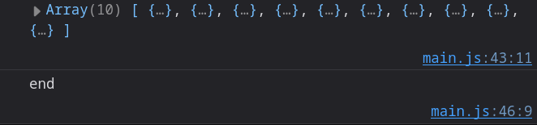
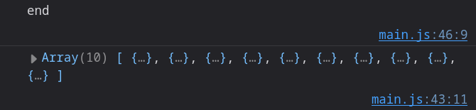

# Some Built-in Functions in JavaScript

## `setTimeout`

`setTimeout` is a JS function that is used to run a function after a certain amount of time.

`setTimeout` is a function that takes two arguments: a function and a time in _milliseconds_. It will call the function after the time has passed.

::: {.columns .ragged columngap=2.5em column-rule="0.0pt solid black"}

This will log the current date to the console after 1 second (1000 milliseconds).

\columnbreak

```{.js .numberLines}
setTimeout(function () => {
  console.log(new Date());
}, 1000);
```

:::

## `setInterval`

`setInterval` is a JS function that is used to run a function repeatedly after a certain amount of time.

`setInterval` is a function that takes two arguments: a function and a time in _milliseconds_. It will call the function repeatedly after the time has passed.

::: {.columns .ragged columngap=2.5em column-rule="0.0pt solid black"}

This will log the current date to the console every 5 seconds (5000 milliseconds).

\columnbreak

```{.js .numberLines}
setInterval(function () => {
  console.log(new Date());
}, 5000);
```

:::

To stop the interval, you can use the `clearInterval` function with the `setInterval` handle that was returned from the `setInterval` function.

```{.js .numberLines}
const handler = setInterval(function () => {
  console.log(new Date());
}, 5000);

setTimeout(function () => {
  clearInterval(handler);
}, 20000);
```

This will log the current date to the console every 5 seconds for 20 seconds then stop.

### Image Slider Example

Let's create an image slider using `setInterval`.

HTML:

```{.html .numberLines}

```

JavaScript:

```{.js .numberLines}
var images = ["images/image1.jpg", "images/image2.jpg", "images/image3.jpg"];
var imgSlide = document.getElementById("slider")
let index = 0;


setInterval(function () => {
  imgSlide.src = images[index];
  index++;
  if (index > images.length - 1) index = 0;
}, 3000);
```

This will change the image every 3 seconds. The if condition is used to reset the index to 0 when it reaches the end of the array.

The idea of next and previous buttons can be added by incrementing or decrementing the index. Pause and play buttons can be added by using `clearInterval` and `setInterval`.

# Storage in JavaScript

JavaScript can store data in different ways:

- Local Storage
- Cookies
- Session Storage

There is other ways but we will focus on these two.

## Cookies

Cookies are **small** pieces of data that are stored in the browser. They are stored in the form of key-value pairs.

You shouldn't store sensitive data in cookies as they are stored in plain text and not encrypted.

Cookies can be stored in the browser until the browser is closed. When the browser is closed, the cookies are deleted/destroyed.

<!-- TODO review this part -->
<!-- - **Persistent Cookies**: -->
<!--
XSS Attacks
-->

To create a cookie, you can use the `document.cookie` object.

```{.js .numberLines}
document.cookie = "name=Mohamed";
```

This will create a cookie with the name `name` and the value `Mohamed`.

You can also set the expiry date, and the path of the cookie.

```{.js .numberLines}
document.cookie = "name=Mohamed; expires=Thu, 18 Dec 2024 12:00:00 UTC; path=/";
```

This will create a cookie with the name `name` and the value `Mohamed` that will expire on the 18th of December 2024, and the path of the cookie is `/`.

To see the cookies in developer tools, you can go to the Application tab (Storage if you are using Firefox) and then click on Cookies.

To read a cookie, you can use the `document.cookie` object.

```{.js .numberLines}
console.log(document.cookie);
```

This will log all the cookies you have in your browser for that website.

## Local Storage

Local storage is a way to store data in the browser. It has a larger storage capacity than cookies.

Local storage doesn't have an expiry date, so the data will be stored until it is deleted.

To store data in local storage, you can use the `localStorage` object. The `localStorage` object stores data in the form of key-value pairs, and it accepts any string as a value.

To see the data in local storage, you can go to the Application tab in developer tools (Storage in Firefox) and then click on Local Storage.

To set an item in local storage, you can use the `setItem` method, and to get an item, you can use the `getItem` method.

```{.js .numberLines}
localStorage.setItem("name", "Mohamed");

console.log(localStorage.getItem("name"));
```

**What if you have an object and you want to store it in local storage?**

You can use `JSON.stringify` to convert the object to a string and then store it in local storage.

JSON is a data format that is human readable. JSON stands for [J]{.underline}ava[S]{.underline}cript [O]{.underline}bject [N]{.underline}otation.

To read the JSON string from local storage, you can use `JSON.parse` to convert it back to an object, so you can use it an access its properties.

```{.js .numberLines}
let person = {
  name: "Mohamed",
  age: 22,
};

localStorage.setItem("person", JSON.stringify(person));

console.log(JSON.parse(localStorage.getItem("person")));
```

## Session Storage

Session storage is similar to local storage, but the data is stored until the browser is closed.

Everything related to the syntax of session storage is the same as local storage, just replace `localStorage` with `sessionStorage`.

```{.js .numberLines}
sessionStorage.setItem("name", "Mohamed");

console.log(sessionStorage.getItem("name"));
```

To store an object in session storage, you can use the same method as local storage.

```{.js .numberLines}
let person = {
  name: "Mohamed",
  age: 22,
};

sessionStorage.setItem("person", JSON.stringify(person));

console.log(JSON.parse(sessionStorage.getItem("person")));
```

# `XMLHttpRequest`

`XMLHttpRequest` is a built-in object in JavaScript that is used to make HTTP requests to a server.

`XMLHttpRequest` is used to send and receive data from a server.

`XMLHttpRequest` has some properties and methods that are used to interact with the server:

- `readyState` is a property that tells you the state of the request based on the following values:
  - `0`: request not initialized
  - `1`: server connection established
  - `2`: request received
  - `3`: processing request
  - `4`: request finished and response is ready
- `onreadystatechange` defines a function that will be called when the `readyState` property changes.
- `responseText` has a property that contains the response data as a string.
- `responseXML` has a property that contains the response data as an XML document.
- `status` has a property that contains the status of the request, examples:
  - `200`: for OK
  - `403`: for Forbidden
  - `404`: for Not Found.
  - There are many other status codes, you can check them [here](https://developer.mozilla.org/en-US/docs/Web/HTTP/Status).

> `200` status code doesn't always mean that the request returned the data successfully, you should check the status code and the response data. For examples you are trying to get a user that doesn't exist, the status code will be `200` but the response data will be an empty object.

- `statusText` property that contains the status message of the request.

If you send an HTTP request to a server and you didn't get a response for a long time, the request will timeout.

Example of using `XMLHttpRequest`:

```{.js .numberLines}
var data;
var http = new XMLHttpRequest();
http.open("GET", "https://jsonplaceholder.typicode.com/users");
http.send();
http.onreadystatechange = function () {
  var status = http.status;
  var readyState = http.readyState;
  if (status === 200 && readyState === 4) {
    // Get the response as string
    console.log(http.responseText);
    // You can also get the response as XML

    // Convert the response to JSON
    console.log(JSON.parse(http.responseText));

    data = JSON.parse(http.responseText);
  }
};

console.log(data); // undefined
```

The code above:

1. Creates a new `XMLHttpRequest` object.
2. Opens a connection to the server using the `open` method.
   1. The first argument is the request method (`GET`, `POST`, etc).
   2. The second argument is the URL of the server.
3. Sends the request to the server using the `send` method.
4. Uses the `onreadystatechange` property to define a function that will be called when the `readyState` property changes.
   1. Checks if the status is `200` and the `readyState` is `4`.
   2. Logs the response as a string.
   3. Logs the response as a JSON object.
5. The `data` variable is `undefined` because it is logged before the response is received, so the `data` variable is still `undefined`.

To solve the issue of the `data` variable being `undefined`, you can pass a third argument to the `open` method, this argument is a boolean that specifies whether the request is asynchronous or not.

synchronous means that the request will block the code execution until the response is received (JS will wait for the response), while asynchronous means that the request will not block the code execution and will be executed in the background and JS will continue executing other lines while the request is being processed.

It's not recommended to use synchronous requests because it has a bad performance.

```{.js .numberLines}
http.open("GET", "https://jsonplaceholder.typicode.com/users", false);
```

## Example

Example of using `XMLHttpRequest` to display data to the user in a list:

### Synchronous Request

Using synchronous request with `XMLHttpRequest`:

```{.js .numberLines}
var http = new XMLHttpRequest();
var data;

http.onreadystatechange = function () {
  if (http.readyState == 4 && http.status == 200) {
    data = JSON.parse(http.responseText);
    printData(data);
  }
};

// false means synchronous
http.open("GET", "https://jsonplaceholder.typicode.com/users", false);

http.send();

function printData(data) {
  var ul = document.createElement("ul");
  data.forEach((element) => {
    var li = document.createElement("li");
    li.textContent = element.name;
    ul.appendChild(li);
  });
  document.body.appendChild(ul);
  console.log(data);
}

console.log("end");
```

In this example the `data` variable will be defined and the `printData` function will be called after the response is received.

JS will wait for till the response is received and execute code inside `printData`, then it will log `end` to the console.

{height=120px}

And this is the console output:

{height=70px}

### Asynchronous Request

Using asynchronous request with `XMLHttpRequest`:

The code will be the same but changing the third argument of the `open` method to `true`, or without passing the third argument because the default value is `true`.

The output in the console will be different:

{height=70px}

`end` is logged before the data is received because the request is asynchronous, so when JS faces the `send` method, it will send the request and continue executing the code without waiting for the response.

# Note On The Assignment

In the assignment you are asked to create a JS library that has some functions. You have to put the library file in a `js` file and add it before your main JS file in the HTML file, so you can use the functions of the library inside your main JS file.
