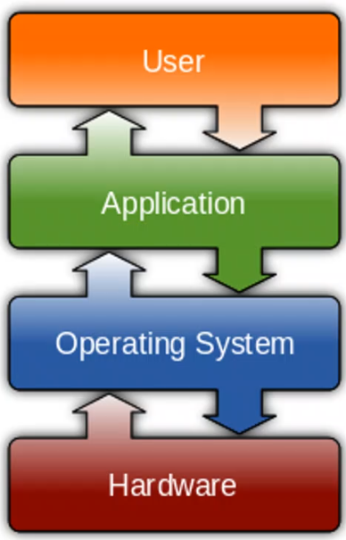

# Operating Systems

::: {.columns .ragged columngap=0.5em column-rule="0.0pt solid black"}

Hardware is everything you can see and touch on a computer.

\columnbreak

{height=200px}

:::

Random Access vs Sequential Access

-   Accumulator in Registers: 1:19:00
-   Buses after it: 1:20:00
-   OS Categories: 2:00:00
-   IPC: 2:30:00
-   3:05:00 and the diagram

Read:

-   28 $\to$ 32

Distributed Systems, Operating Systems, and Parallel computing course on Mahara tech

Scheduling Algorithms:

-   First come first serve
-   Shortest job first
-   Round robin

PCIe, ACPI, I2C, ACPI
