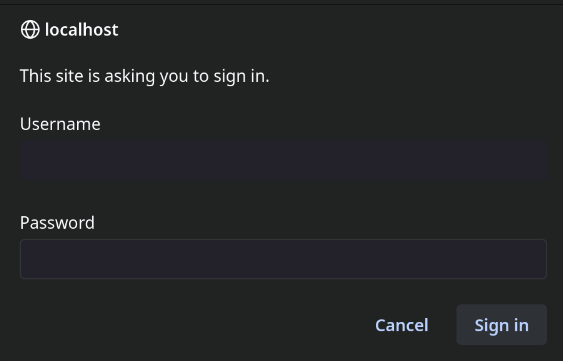
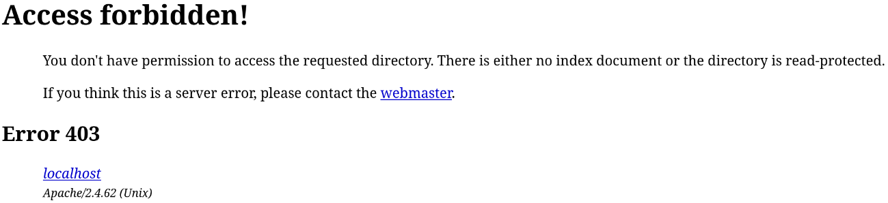

\begin{longtable}[]{@{}ll@{}}
\toprule\noalign{}
\multicolumn{2}{c}{Team Members} \\
\midrule\noalign{}
\endhead
\bottomrule\noalign{}
\endlastfoot
Mohamed Ahmed Emary & Fathy Elbadrawy \\
Andrew Essam & Mohamed Ali El-Ghannam \\
Amr Ahmed Khallaf & Abdullah Mahany \\
\end{longtable}

# Assignment Questions

## Question 1

> Install Apache HTTP server

Installation on Debian-based systems: `sudo apt install apache2`

Installation on Arch Linux: `sudo pacman -S apache --needed`


<!-- {width=85%} -->

Then we can start Apache server service via `systemd`: `sudo systemctl start httpd.service`

## Question 2

> Create two simple html pages named `page1.html`, `page2.html` then use the suitable directive to automatically redirect from `localhost/page1.html` to `localhost/page2.html`.

Steps:

1. Create two HTML pages `page1.html` and `page2.html` in `/srv/http/session-1/q2/` directory.

{width=70%}

2. Then add the code below to `page2.html`:

```{.html .numberLines}
<!DOCTYPE html>
<html>
  <head>
    <title>Page 2</title>
  </head>
  <body>
    <h1>Welcome to Page 2</h1>
  </body>
</html>
```

3. Edit apache global config in `/srv/http/session-1/q2/` Directory block, change `AllowOverride None` to `AllowOverride All`:

```{.apache .numberLines}
<Directory "/srv/http/session-1/q2">
    Options Indexes FollowSymLinks
    AllowOverride All
    Require all granted
</Directory>
```

4. Create a `.htaccess` file in `/srv/http/session-1/q2/` and add:

```{.apache .numberLines}
Redirect /session-1/q2/page1.html /session-1/q2/page2.html
```

5. Restart the apache server with `sudo systemctl restart httpd`.
6. Now when we visit `localhost/session-1/q2/page1.html` we get redirected to `localhost/session-1/q2/page2.html`, and the browser shows the content of `page2.html`.

{width=30%}

## Question 3

> Ask for username and password when accessing a directory

Steps:

1. Inside `/srv/http/session-1/q3/` directory, we run the command below to create a `.htpasswd` file:

```{.bash .numberLines}
htpasswd -c ./.htpasswd team4
```

{width=70%}

2. Then inside apache global config `/etc/httpd/conf/httpd.conf`, we add the following block:

```{.apache .numberLines}
<Directory "/srv/http/session-1/q3">
    AuthType Basic
    AuthName "Enter your username and password"
    AuthUserFile /srv/http/session-1/q3/.htpasswd
    Require valid-user
</Directory>
```

This block enables basic authentication for the directory `/srv/http/session-1/q3/` and uses the `.htpasswd` file for authentication.

3. Restart the apache server with `sudo systemctl restart httpd`.
4. Now when we visit `localhost/session-1/q3/` we get a prompt to enter a username and password.

{width=40%}

## Question 4

> Apply authentication before downloading PDF files

Steps:

1. Create a directory named `q4` in `/srv/http/session-1/` and add a pdf file to it.
2. Inside apache global config `/etc/httpd/conf/httpd.conf`, add the following block:

```{.apache .numberLines}
<Directory "/srv/http/session-1/q4">
	AllowOverride All
</Directory>
```

3. Inside `/srv/http/session-1/q3/` directory, we run the command below to create a `.htpasswd` file:

```{.bash .numberLines}
htpasswd -c ./.htpasswd team4
```

4. In the same directory, create a `.htaccess` file and add the following content:

```{.apache .numberLines}
AuthType Basic
AuthName "Enter your username and password to access pdf"
AuthUserFile /srv/http/session-1/q4/.htpasswd
Require valid-user
```

{width=70%}

5. Restart the apache server with `sudo systemctl restart httpd`.
6. Now when we visit `localhost/session-1/q4/` we get a prompt to enter a username and password.

## Question 5

> Create a directory then allow access to one of your classmates only

Suppose my classmate's IP address is `165.32.65.74`

Steps:

1. Create two files `test1.html` and `test2.html` in `/srv/http/session-1/q5/` directory.
2. Inside apache global config `/etc/httpd/conf/httpd.conf`, add the following block:

```{.apache .numberLines}
<directory "/srv/http/session-1/q5/">
    deny from all
    allow from 165.32.65.74
    order deny,allow
</directory>
```

3. Restart the apache server with `sudo systemctl restart httpd`.
4. Now when we visit `localhost/session-1/q5/` we get a `403 Forbidden` error.

{width=90%}

## Question 6

<!-- https://stackoverflow.com/q/2530372 -->

> Disable listing the directory content (hint use `Indexes`)

Apache serves the path `/srv/http/` by default on Arch Linux, so I created a directory for session 1 assignment with the name `session-1` and added a sub directory `q6` in it for question 6.

In apache global config `/etc/httpd/conf/httpd.conf`, I created a `<Directory>` block with this content:

<!-- for the path `/srv/http/session-1/q6` and set the `Options` directive to `FollowSymLinks` and `Indexes` to `None`. -->

```{.apache .numberLines}
<Directory "/srv/http/session-1/q6">
    Options FollowSymLinks
    AllowOverride None
    Require all granted
</Directory>
```

After adding that block, I restarted the apache server with `sudo systemctl restart httpd` and now when I visit `http://localhost/session-1/q6` I get a `403 Forbidden` error.

{width=90%}

<!--
Arch wiki page for apache http server: https://wiki.archlinux.org/title/Apache_HTTP_Server


Resources and links:

- https://developer.mozilla.org/en-US/docs/Web/HTTP/Status
- https://en.wikipedia.org/wiki/Internet_protocol_suite
- https://search.brave.com/search?q=what%20is%20hostname%20server%20name%20and%20dns&spellcheck=0&source=alteredQuery
- https://superuser.com/q/59093
- https://youtu.be/72snZctFFtA
- https://en.wikipedia.org/wiki/Client%E2%80%93server_model
- https://www.geeksforgeeks.org/client-server-model/
- https://en.wikipedia.org/wiki/Publish%E2%80%93subscribe_pattern
- https://search.brave.com/search?q=what+is+an+ip+address
- https://search.brave.com/search?q=how+to+turn+server+into+web+server&source=web
- https://chat.deepseek.com/a/chat/s/54702219-59da-4341-a2cb-b0e7860ffce8

 -->

<!--
filematch
directorymatch

 -->
