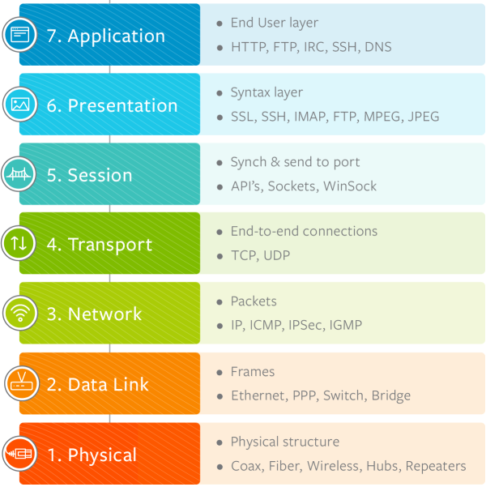
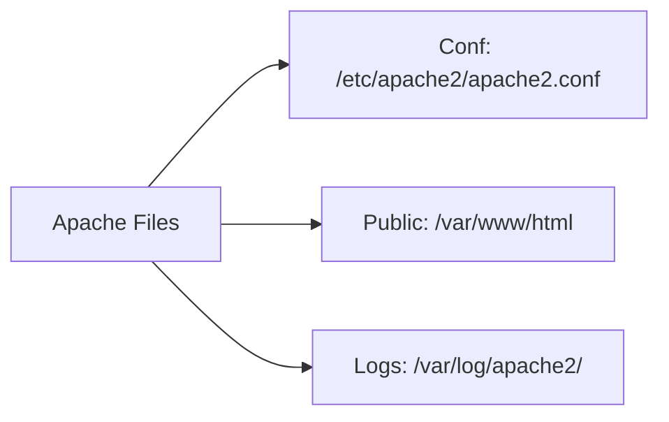

# Web Addresses and Internet Protocols

- a protocol (e.g. http),
- a servername (e.g. `www.apache.org`),
- a URL-path (e.g. `/docs/current/getting-started.html`), and
- possibly a query string (e.g. `?arg=value`) used to pass additional arguments to the server

Example: `https://www.google.com/search?q=speedtest`

The protocol is `https`, the server name is `www.google.com`, the query string is `q=speedtest`, and the value is `speedtest`.

Common internet protocol other than HTTP and which OSI model layer does it belong to?

- UDP (User Datagram Protocol) is in the transport layer of the OSI model. It is used for streaming media, VoIP, and online gaming.
- FTP (File Transfer Protocol) is in the application layer of the OSI model. It is used to transfer files between computers.
- TCP (Transmission Control Protocol) is in the transport layer of the OSI model. It is used for web browsing, email, and file transfers.

There are many other internet protocols, you can find each protocol and its OSI model layer in this image:

{width=40%}

# IP Address

IP (Internet Protocol) address is a unique identifier for a device connected to a network. It is used to route data between devices on the internet.

# DNS

DNS (Domain Name System) is a system that translates domain names (e.g. `www.apache.org`) into IP addresses (e.g. `151.101.2.132`)

[This video](https://www.youtube.com/watch?v=72snZctFFtA&t=45s) explains how DNS lookup works

Cloudflare is one of the most DNS service providers. You can use their service by changing your DNS server to `1.1.1.1`

- What is a hostname?
- What is Client/Server Model?
- What is Pub/Sub Model?
- Anatomy of `GET` Request

{width=70%}

- What is the difference between `HTTP` and `HTTPS`
- What is sniffing?
- Anatomy of Request image
- Status codes
- What is a web server
- how does web servers host sites
  - Example web servers: Apache, Nginx, etc.

These are the apache files paths in Ubuntu, for other distributions, the paths may vary:

<!--
Write it using mermaid

https://wiki.archlinux.org/title/Apache_HTTP_Server
 -->

Apache Directives:

- `Timeout` directive - The Timeout directive defines the number of seconds Apache httpd will wait for a GET, POST, PUT, or DELETE request.
- `ServerRoot` directive - The path to the server’s configuration
- `PidFile` directive - The process identification number for the httpd registered at starting the server
- `ServerName` directive - This is where you declare the name of your website
- `DocumentRoot` directive - This is where your web documents (html files, images etc) should be located.
- `Listen` directive - The Listen directive instructs Apache httpd to listen to only specific IP addresses or ports

---

- The server is configured by placing configuration directives in configuration files.
- A directive is a keyword followed by one or more arguments that set its value.
- In addition to the main configuration files, certain directives may go in `.htaccess` files located in the content directories. `.htaccess` files are primarily for people who do not have access to the main server configuration file(s)

- What are modules?

<!--

1. Install Apache HTTP server
2. Create two simple html pages named "page1.html, page2.html" then use the suitable directive to automatically redirect from localhost/page1.html to localhost/page2.html.
3. Ask for username and password when accessing a directory
4. Apply authentication before downloading PDF files.
5. Create a directory then allow access to one of your classmates only.
6. Disable listing the directory content (hint use indexes)

What is the path used in local dns
 -->
