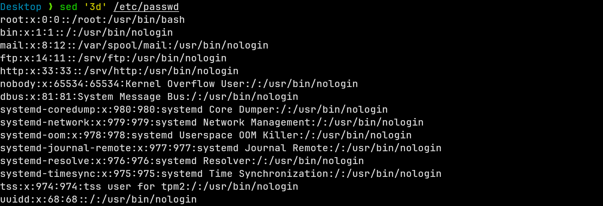
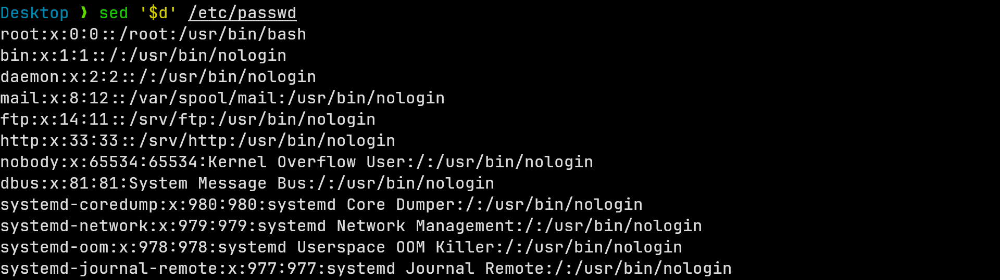
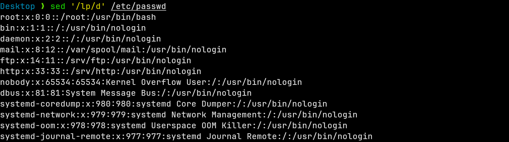
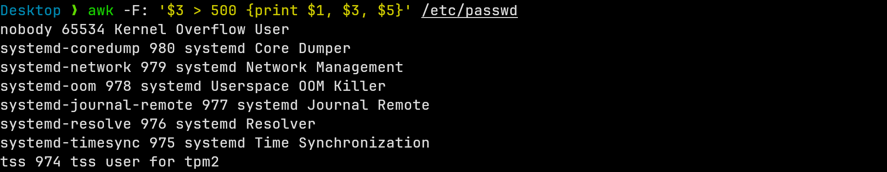
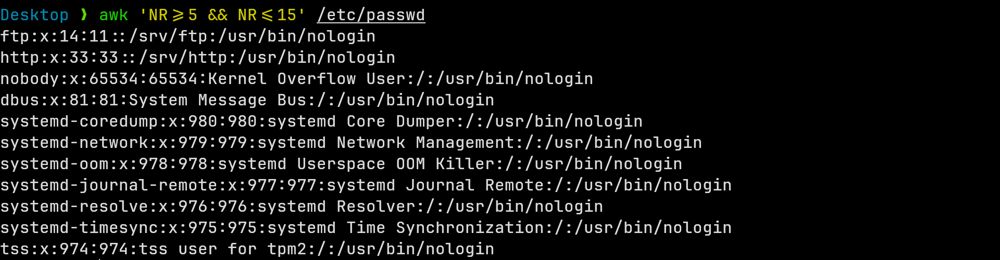
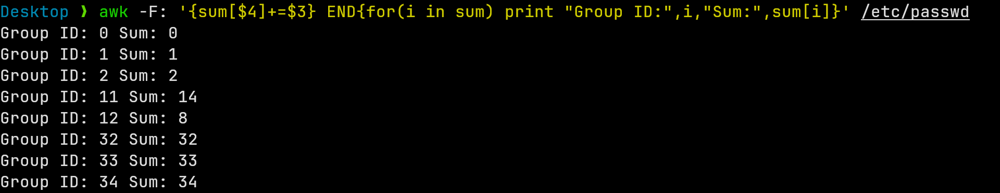

# Using `sed` utility

## Question 1

> Display the lines that contain the word `lp` in `passwd` file.

```bash
sed -n '/lp/p' /etc/passwd
```


## Question 2

> Display `passwd` file except the third line.

```bash
sed '3d' /etc/passwd
```



## Question 3

> Display `passwd` file except the last line.

```bash
sed '$d' /etc/passwd
```



## Question 4

> Display `passwd` file except the lines that contain the word `lp`.

```bash
sed '/lp/d' /etc/passwd
```



## Question 5

> Substitute all the words that contain `lp` with `mylp` in `passwd` file.

```bash
sed 's/lp/mylp/g' /etc/passwd
```


# Using `awk` utility

## Question 1

> Print full name (comment) of all users in the system.

```bash
awk -F: '{print $5}' /etc/passwd
```

**_The empty lines are the users that do not have a comment field._**


## Question 2

> Print login, full name (comment) and home directory of all users. (Print each line preceded by a line number)

```bash
awk -F: '{print NR ") " $1 " " $5 " " $6}' /etc/passwd
```


## Question 3

> Print login, UID and full name (comment) of those UID is greater than 500.

```bash
awk -F: '$3 > 500 {print $1, $3, $5}' /etc/passwd
```



## Question 4

> Print login, UID and full name (comment) of those UID is exactly 500.

```bash
awk -F: '$3 == 500 {print $1, $3, $5}' /etc/passwd
```


## Question 5

> Print line from 5 to 15 from `passwd`.

```bash
awk 'NR>=5 && NR<=15' /etc/passwd
```



## Question 6

> Change `lp` to `mylp`.

```bash
awk '{gsub(/lp/, "mylp"); print}' /etc/passwd
```


## Question 7

> Print all information about greatest UID.

```bash
awk -F: 'BEGIN{max=0} {if($3>max){max=$3; line=$0}} END{print line}' /etc/passwd
```


## Question 8

> Get the sum of all accounts id's.

```bash
awk -F: '{sum+=$3} END{print "Total UID sum:", sum}' /etc/passwd
```


# Bonus Questions

## Question 1

> Get the sum of accounts id's that has the same group.

```bash
awk -F: '{sum[$4]+=$3} END{for(i in sum) print "Group ID:",i,"Sum:",sum[i]}' /etc/passwd
```



<!-- ## Question 2

> Make the User-Group Report.

```bash
awk -F: 'BEGIN {
    print "User-Group    Report"
    print "----------------------"
}
{
    users[$4] = users[$4] ? users[$4] " " $1 : $1
}
END {
    for (group in users) {
        printf "Group%s        Name:\n", group
        split(users[group], userarray, " ")
        for (i in userarray)
            printf "%-12s\n", userarray[i]
        print ""
    }
}' /etc/passwd
``` -->
