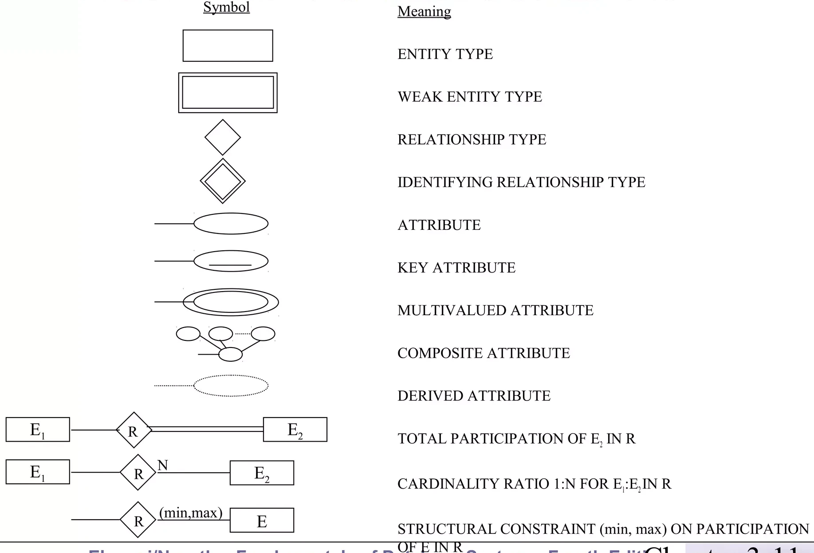
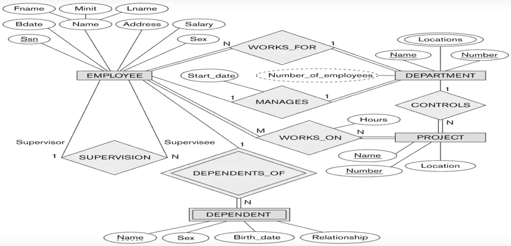

# Database

## What is a Database

In the context of Relational Database, a database is a collection of **_Related_** data. If there is no relation between the data then it is not a database. It may be data or information.

Database is a structured collection of records. This means that each column in the database table has a specific data type. For example, a column may be of type integer, date, or string.

## Database Management System (DBMS)

### What is DBMS

DBMS is the software that is used to manage the database. Examples of DBMS include MS Access (Microsoft Access which is an old DBMS), SQL Server, Oracle, MySQL, and _PostgreSQL_.

We will use PostgreSQL in this course. Choosing the database depends on many factors, one of them is the programming language you are using.

### Advantages of DBMS

1. **Controlling Redundancy**: Redundancy is the repetition of data in the database. DBMS helps in controlling redundancy.
2. **Restricting Unauthorized Access**: Not everyone can access the database, only authorized users. This helps in maintaining the security of the database.
3. **Sharing of Data**: Data can be shared among multiple users (authorized users).
4. **Enforcing Integrity Constraints**: The constraints that must be followed when inserting data into the database (not any data can be inserted).
5. **Inconsistency can be avoided**: Inconsistency is not allowed in the database, and DBMS helps in avoiding inconsistency. For example a customer can't make an order without having an account.
6. **Providing Backup and Recovery**: DBMS provides ways to backup and recover the database in case of a failure.

These advantages are not dependent on the type of DBMS you are using, they should be available in all DBMS.

### Disadvantages of DBMS

1. **Needs Expertise to Use**: You need to have people with expertise to use the DBMS, which will be expensive.
2. **DBMS Cost**: DBMS itself is expensive.
3. **A DBMS May be Incompatible With Other DBMS**: Sometimes a code that works on one DBMS may not work on another DBMS.

## What is a Database System

A database system is the software that is made using a programming language to interact with the database, and you as a developer should create systems like this. There is a lot of examples for database systems like banking systems, cashier systems, and many more.

## Database Users

1. **_Database Administrator (DBA)_**: The person who is responsible for the database server, and the database itself. He should have knowledge in:
   1. **_OS_** as the database server may be installed on any OS so he should know how to use that OS
   2. The database itself (**SQL**).
   3. **Security** as he is responsible for the security of the database.
   4. **Networking** as the database server may be accessed from the internet and he needs to allow only authorized users to access the database,
2. **_System analyst_**: A person with a lot of experience and knowledge in the database, he is responsible for the general design of the database.
3. **_Database designer_**: A person who is responsible for designing the database, after the system analyst gives him the general specifications of the database.
4. **_Application developer_**: A person who is responsible for developing the application that interacts with the database. Inside the application there is a SQL code that interacts with the database, and this code is written by the application developer.
5. **_Testers_**: People who are responsible for testing the application and the database to make sure that the application is working as expected without any bugs before being shipped to the customer.
6. **_BI (Business Intelligence) Developer_**: A person who is responsible for analyzing the data in the database and creating reports and dashboards for the management to help them in making decisions.
7. **_End Users_**: People who are using the application that interacts with the database.

## Database Life Cycle

1. **_ERD (Entity Relationship Diagram)_**: The first step in creating a database is to create an ERD. This is a diagram that shows the entities in the database and the relationships between them.
2. **_Mapping_**: Mapping the ERD to the database tables.
3. **_Implementation_**: Creating the database using one of the DBMS and writing the SQL code to create the tables.
4. **_Querying Data_**: Writing SQL queries to get data from the database.

## Entity Relationship Diagram (ERD)

DB designer is responsible for creating the ERD.

To be able to create the ERD you need to answer the following questions:

1. What are the entities in the database?
2. What are the attributes of each entity?
3. What is the type of each attribute?
4. What are the relationships between the entities?

### Entity

An entity is a real-world object that has some properties. For example, a course is an entity, and the HTML course is an instance of the course entity.

## Attributes & Types of Attributes

An attribute is a property of an entity. For example, the course entity has an attribute called name.

### Types of Attributes

An attribute can be of the following types:

1. Key: An attribute that uniquely identifies the entity.
2. Composite: An attribute that is made of multiple attributes.
3. Multi-valued: An attribute that can have multiple values.
4. Derived: An attribute that is derived from other attributes.

Suppose we have an entity called `Employee`, it will have the following attributes:

<!--
| Attribute     |      Key       | Multi-valued   |   Composite    |    Derived     |    Normal      |
| ------------- | :------------: | :------------: | :------------: | :------------: | :------------: |
| `EmpNo`       | \faCheckCircle |                |                |                |                |
| `EmpName`     |                |                | \faCheckCircle |                |                |
| `EmpAddress`  |                |                | \faCheckCircle |                |                |
| `EmpSalary`   |                |                |                |                | \faCheckCircle |
| `EmpMobile`   | \faCheckCircle | \faCheckCircle |                |                |                |
| `EmpMail`     | \faCheckCircle | \faCheckCircle |                |                |                |
| `EmpBD`       |                |                |                |                | \faCheckCircle |
| `EmpHireDate` |                |                |                |                | \faCheckCircle |
| `EmpAge`      |                |                |                | \faCheckCircle |                |
-->

<!-- prettier-ignore-start -->
\begin{longtable}[]{@{}
  >{\raggedright\arraybackslash}p{(\linewidth - 10\tabcolsep) * \real{0.1667}}
  >{\centering\arraybackslash}p{(\linewidth - 10\tabcolsep) * \real{0.1667}}
  >{\centering\arraybackslash}p{(\linewidth - 10\tabcolsep) * \real{0.1667}}
  >{\centering\arraybackslash}p{(\linewidth - 10\tabcolsep) * \real{0.1667}}
  >{\centering\arraybackslash}p{(\linewidth - 10\tabcolsep) * \real{0.1667}}
  >{\centering\arraybackslash}p{(\linewidth - 10\tabcolsep) * \real{0.1667}}@{}}
\toprule\noalign{}
\begin{minipage}[b]{\linewidth}\raggedright
Attribute
\end{minipage} & \begin{minipage}[b]{\linewidth}\centering
Key
\end{minipage} & \begin{minipage}[b]{\linewidth}\centering
Multi-valued
\end{minipage} & \begin{minipage}[b]{\linewidth}\centering
Composite
\end{minipage} & \begin{minipage}[b]{\linewidth}\centering
Derived
\end{minipage} & \begin{minipage}[b]{\linewidth}\centering
Normal
\end{minipage} \\
\midrule\noalign{}
\endhead
\bottomrule\noalign{}
\endlastfoot
\texttt{EmpNo} & \faCheckCircle & & & & \\
\hline
\texttt{EmpName} & & & \faCheckCircle & & \\
\hline
\texttt{EmpAddress} & & & \faCheckCircle & & \\
\hline
\texttt{EmpSalary} & & & & & \faCheckCircle \\
\hline
\texttt{EmpMobile} & \faCheckCircle & \faCheckCircle & & & \\
\hline
\texttt{EmpMail} & \faCheckCircle & \faCheckCircle & & & \\
\hline
\texttt{EmpBD} & & & & & \faCheckCircle \\
\hline
\texttt{EmpHireDate} & & & & & \faCheckCircle \\
\hline
\texttt{EmpAge} & & & & \faCheckCircle & \\
\end{longtable}
<!-- prettier-ignore-end -->

### Participation

<!-- TODO review this part from video -->

If you see **_May_** in the relationship description, this means that the participation is optional represented by a single line. On the other hand, if you see **_Must_** this means that the participation is mandatory (1 or more) represented by a double line.

### Weak Entity

A weak entity is an entity that depends on another entity to exist. For example, the `OrderItem` entity depends on the `Order` entity to exist.

### Relationships

A relationship is a connection between two entities.

### Types of Relationships

1. Binary relationships: A relationship between two entities, it can have one of the following Cardinalities:
   1. **_One-to-One_**: One entity is associated with only one entity. For example, each resident has only one passport.
   2. **_One-to-Many_**: One entity is associated with many entities. For example, each advisor can advise many students.
   3. **_Many-to-Many_**: Many entities are associated with many entities. For example, each student can enroll in many courses and each course can have many students.
2. Recursive relationships: A relationship between an entity and itself.
3. Ternary relationships: A relationship between three entities.

### ERD Notation

{width=50%}

Some Notes:

1. A relation is a single line when the participation is optional, and a double line when the participation is mandatory.
2. A weak entity is represented by a double rectangle.
3. Weak entities can't exist without the strong entity. It's identified by the strong entity.
4. Derived attribute is represented by a dashed line.
5. If there is two relations between two entities and both relations are many-to-many, then you did something wrong.

Some Notes on the lab questions:

1. For the lab questions, any numeric value should be a key.
2. You can either draw the ERD on paper or use a software.

### ERD Example

A company is organized into departments. Each department has a unique name, a unique number, and a particular employee who manages the department. A department may have several locations.

A department may control a number of projects, each of which has a unique name, a unique number, and a single location. A project must controlled by department

We store employee’s name, social security number, address, salary, gender and birth date. An employee must be assigned to one department and must work on one or more projects, which are not necessarily controlled by the same department. We keep track of the number of hours per week that an employee works on each project. We also keep track of the direct supervisor of each employee.

We want to keep track of the dependents of each employee for insurance purposes. We keep each dependent’s first name, gender, birth date and relationship to that employee.

<!--
TODO review this part from video or watch any yt video for the same problem
-->
