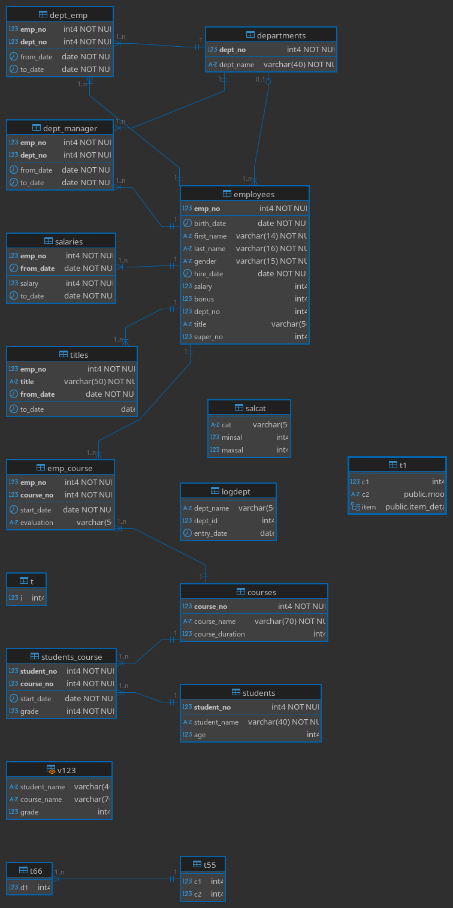

We will work on `training` database with this schema:

{height=550px}

# Database Join

## Cross Join

Cross join returns all possible combinations of rows from two tables.

```{.sql .numberLines}
SELECT
  first_name,
  last_name,
  salary,
  dept_name
FROM
  employees,
  departments;
```

Cross join can be used via either `CROSS JOIN` or a comma `,` between table names as in the query above.

## Inner Join

Inner join returns only the rows that have matching values in both tables.

For if we want to select values from both `employees` and `departments` tables where `dept_no` is the same in both tables, we can use the following query.

Since the relation between `employees` and `departments` tables is based on the `dept_no` column, we specified this column in the `WHERE` clause.

```{.sql .numberLines}
SELECT
  first_name,
  last_name,
  salary,
  dept_name
FROM
  employees e,
  departments d
WHERE
  e.dept_no = d.dept_no;
```

The query above will return 997 rows, although the `employees` table has 1000 rows and the `departments` table has 9 rows. This is because there are 3 employees in the `employees` table having `NULL` value in the `dept_no` column.

You can't use `dept_no` alone in the `SELECT` clause, because it's ambiguous (both tables have `dept_no` column), so we need to specify the table name as in `e.dept_no`.

---

Another example if we want to get the grade of each student in each course, we will work on 3 tables (`students`, `courses`, and `students_course`) and use the primary and foreign keys to join the tables.

```{.sql .numberLines}
SELECT
  student_name,
  course_name,
  grade
FROM
  students s,
  courses c,
  students_course sc
WHERE
  sc.student_no = s.student_no
  AND c.course_no = sc.course_no;
```

---

To select which employee worked in which department, we can use the following query.

```{.sql .numberLines}
SELECT
  first_name,
  last_name,
  dept_name
FROM
  employees e,
  departments d,
  dept_emp de
WHERE
  e.emp_no = de.emp_no
  AND d.dept_no = de.dept_no
ORDER BY
  e.emp_no;
```

<!--
TODO: اراجع علي
outer join, left join, right join
full join,
self join
 -->

<!-- ## Left Join, Right Join, Outer Join, and Full Join

Left join returns all rows from the left table, and the matched rows from the right table.

For example to select all employees who work in a department, we can use the following query.

```{.sql .numberLines}
SELECT
  first_name,
  last_name,
  dept_name
FROM
  employees e
  LEFT JOIN departments d ON e.dept_no = d.dept_no
ORDER BY
  dept_name DESC;
```
-->

# Aggregate Functions

Aggregate functions work on a set of values and return a single value.

We will explain `COUNT`, `SUM`, `AVG`, `MIN`, and `MAX` functions.

To get the minimum, maximum, average, and total salary of employees, we can use the following query.

```{.sql .numberLines}
SELECT
  MIN(salary),  -- Minimum salary between all employees
  MAX(salary),  -- Maximum salary between all employees
  SUM(salary),  -- Total salary for all employees
  AVG(salary),  -- Average salary for all employees
  COUNT(salary) -- Number of employees
FROM
  employees;
```

This query will return 5 columns and 1 row. The query above will operate on the whole table, since there is no selected column in the `SELECT` clause.

## `GROUP BY` & `HAVING`

To select another column next to the aggregate functions, we need to group the rows based on that column using `GROUP BY`.

So for example if we want to get the total `salary` for each `gender` we need to `GROUP BY` the `gender` column.

```{.sql .numberLines}
SELECT
  gender,
  SUM(salary)
FROM
  employees
GROUP BY
  gender;
```

\begin{box3}{Note 1:}{black}
Any column selected next to an aggregate function should be included in the \texttt{GROUP BY} clause.
\end{box3}

---

To get the sum of salaries for each department, we can use the following query.

```{.sql .numberLines}
SELECT
  dept_name,
  SUM(salary)
FROM
  employees e,
  departments d
WHERE
  e.dept_no = d.dept_no
GROUP BY
  dept_name;
```

To get the sum of salary and count of employees in each department:

```{.sql .numberLines}
SELECT
  dept_name,
  SUM(salary),
  COUNT(emp_no)
FROM
  employees e,
  departments d
WHERE
  e.dept_no = d.dept_no
GROUP BY
  dept_name;
```

\begin{box3}{Note 2:}{black}
When applying a condition on an aggregate function put it inside \texttt{HAVING} clause not \texttt{WHERE}
\end{box3}

To get the sum of salary and count of employees in each department where the total salary is more than 15,000,000:

```{.sql .numberLines}
SELECT
  dept_name,
  SUM(salary),
  COUNT(emp_no)
FROM
  employees e,
  departments d
WHERE
  e.dept_no = d.dept_no
GROUP BY
  dept_name
HAVING
  SUM(salary) > 15000000
ORDER BY
  SUM(salary) DESC;
```

To get the number of courses for each department:

```{.sql .numberLines}
SELECT
  student_name,
  COUNT(course_no)
FROM
  students_course sc,
  students s
WHERE
  s.student_no = sc.student_no
GROUP BY
  student_name;
```

To get students with `age > 25`, we used `WHERE` not `HAVING` because _we are filtering on a column not on a function_:

```{.sql .numberLines}
SELECT
  student_name,
  COUNT(course_no)
FROM
  students_course sc,
  students s
WHERE
  s.student_no = sc.student_no
  AND age > 25
GROUP BY
  student_name;
```

In the query below we are grouping by `student_no` not `student_name` because we may have two students with the same name which will cause them to be grouped together as one student:

```{.sql .numberLines}
SELECT
  student_name,
  SUM(grade),
  COUNT(course_no)
FROM
  students s,
  students_course sc
WHERE
  s.student_no = sc.student_no
GROUP BY
  s.student_no,
  student_name;
```

To get the number of salaries each employee has in the `salaries` table, we can use the following query.

<!--
  -- COUNT(DISTINCT s.salary) AS emp_salary_count
  -- COUNT(s.emp_no) AS emp_count
 -->

```{.sql .numberLines}
SELECT
  e.emp_no,
  first_name,
  last_name,
  COUNT(s.salary) AS emp_salary_count
FROM
  employees e,
  salaries s
WHERE
  e.emp_no = s.emp_no
GROUP BY
  e.emp_no,
  first_name,
  last_name
ORDER BY
  emp_no;
```

And if we want to get employees with more than 10 different salary records, we can add `HAVING`:

```{.sql .numberLines}
SELECT
  e.emp_no,
  first_name,
  last_name,
  COUNT(s.salary) AS emp_salary_count
FROM
  employees e,
  salaries s
WHERE
  e.emp_no = s.emp_no
GROUP BY
  e.emp_no,
  first_name,
  last_name
HAVING
  COUNT(s.salary) > 10
ORDER BY
  emp_no;
```

# `UNION ALL` & `UNION`

1. `UNION ALL` is used to combine the results of two or more `SELECT` statements, and it returns all rows from the combined queries.
2. `UNION` is used to combine the results of two or more `SELECT` statements, and it returns only **_distinct_** rows from the combined queries. For example if a row is returned by both queries, it will be shown only once.

\begin{box3}{Note 3:}{black}
For the union to work we must satisfy the following conditions:
\begin{itemize}
\item The number of columns in each query must be the same
\item The data type of each column must be the same
\end{itemize}
\end{box3}

You may have two different columns but with the same data type the union will work for that case but the data will be meaningless, so you should be careful when using `UNION`

If we have those two queries:

::: {.columns .ragged columngap=2.5em column-rule="0.0pt solid black"}

```{.sql .numberLines}
SELECT
  first_name,
  last_name,
  salary
FROM
  employees
WHERE
  salary > 105000;
```

\columnbreak

```{.sql .numberLines}
SELECT
  first_name,
  last_name,
  salary
FROM
  employees
WHERE
  salary < 120000;
```

:::

Each one will return a different table and we want to combine the results of both queries, we can use `UNION ALL`:

```{.sql .numberLines}
SELECT
  first_name,
  last_name,
  salary
FROM
  employees
WHERE
  salary > 105000
UNION ALL
SELECT
  first_name,
  last_name,
  salary
FROM
  employees
WHERE
  salary < 120000;
```

We can get the result of the query above using `WHERE ... OR ...`:

```{.sql .numberLines}
SELECT
  first_name,
  last_name,
  salary
FROM
  employees
WHERE
  salary > 105000
  OR salary < 130000
ORDER BY
  first_name,
  last_name;
```

# `INTERSECT` & `EXCEPT`

1. `INTERSECT` returns only the rows that are returned by both queries.
2. `EXCEPT` returns only the rows that are returned by the first query and not by the second query.

For example if we have those two queries:

::: {.columns .ragged columngap=2.5em column-rule="0.0pt solid black"}

```{.sql .numberLines}
SELECT
  first_name,
  last_name,
  salary
FROM
  employees
WHERE
  salary > 105000;
```

\columnbreak

```{.sql .numberLines}
SELECT
  first_name,
  last_name,
  salary
FROM
  employees
WHERE
  salary < 130000
ORDER BY
  first_name,
  last_name;
```

:::

We can use `INTERSECT` to get the employees who have a salary between 105,000 and 130,000:

```{.sql .numberLines}
SELECT
  first_name,
  last_name,
  salary
FROM
  employees
WHERE
  salary > 105000
INTERSECT
SELECT
  first_name,
  last_name,
  salary
FROM
  employees
WHERE
  salary < 130000
ORDER BY
  first_name,
  last_name;
```

We can also use `BETWEEN` to get the same result:

```{.sql .numberLines}
SELECT
  first_name,
  last_name,
  salary
FROM
  employees
WHERE
  salary BETWEEN 105000 AND 130000
ORDER BY
  first_name,
  last_name;
```

---

If we have a number of departments and we want to get departments that have no employees, we can use `EXCEPT`:

```{.sql .numberLines}
SELECT
  dept_no,
  dept_name
FROM
  departments;
```

The query above will return all departments, and we want to get the departments that have no employees, so we will select unique `dept_no` from the `employees` table and use `EXCEPT` to get the departments that have no employees:

```{.sql .numberLines}
SELECT
  dept_no,
  dept_name
FROM
  departments
EXCEPT
SELECT DISTINCT
  d.dept_no,
  dept_name
FROM
  employees e,
  departments d
WHERE
  e.dept_no = d.dept_no;
```

Here the query after `EXCEPT` will return the departments that have employees, then we use `EXCEPT` to subtract those departments from all departments.
