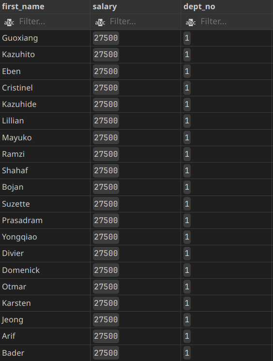
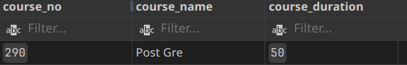
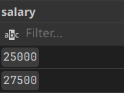
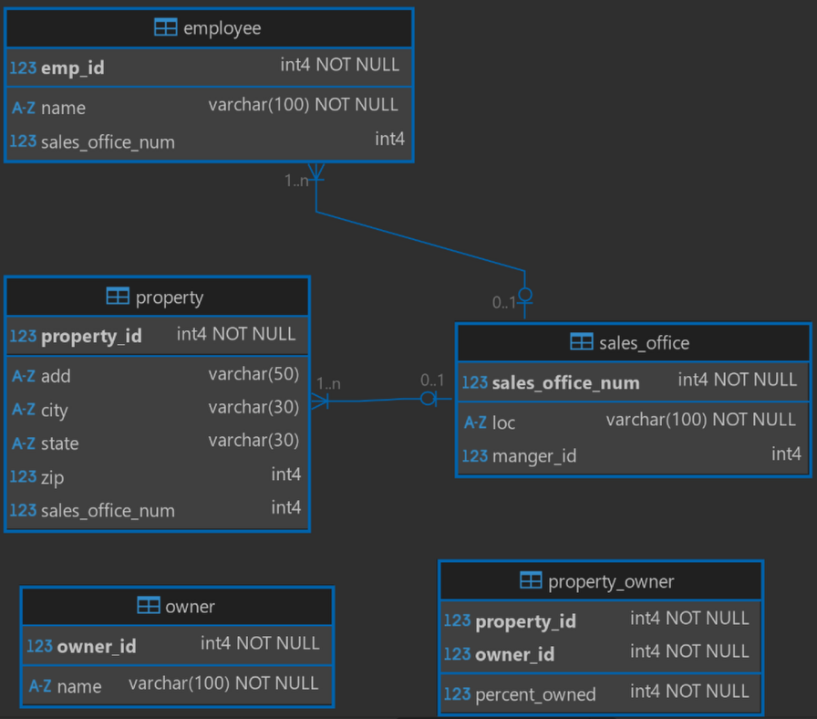

# Question 1

Update employee by increase bonus to 10% of salary for employee in department `Marketing`.

::: {.columns columngap=1.5em}

```{.sql .numberLines}
UPDATE employees
SET
  salary = salary * 1.1
WHERE
  dept_no = (
    SELECT
      dept_no
    FROM
      departments
    WHERE
      dept_name = 'Marketing'
  );


SELECT
  first_name,
  salary,
  dept_no
FROM
  employees
WHERE
  dept_no = (
    SELECT
      dept_no
    FROM
      departments
    WHERE
      dept_name = 'Marketing'
  );
```

\columnbreak



:::

# Question 2

Delete courses which no students learn it and no employees teach it.

::: {.columns .ragged columngap=1.5em}

```{.sql .numberLines}
DELETE FROM courses
WHERE
  course_no NOT IN (
    SELECT DISTINCT
      course_no
    FROM
      students_course
  )
  AND course_no NOT IN (
    SELECT DISTINCT
      course_no
    FROM
      emp_course
  );
```

\columnbreak



:::

# Question 3

Increase salary by 10% of it for smallest 2 different salaries on employees table.

::: {.columns .ragged columngap=1.5em}

```{.sql .numberLines}
UPDATE employees
SET
  salary = salary * 1.1
WHERE
  salary IN (
    SELECT DISTINCT
      salary
    FROM
      employees
    WHERE
      salary IS NOT NULL
    ORDER BY
      salary LIMIT 2
  );
```

\columnbreak

{width=150px}

:::

# Question 4

Design database for these tables and make constraint

**_Tables:_**

- `sales_office (sales_office_num, loc, manger_id)`
- `employee (emp_id, name, sales_office_num)`
- `property (property_id, add, city, state, zip, sales_office_num)`
- `owner (owner_id, name)`
- `property_owner (property_id, owner_id, percent_owned)`

**_Constraints:_**

- City must be `Cairo` or `Banha` or `Alex`
- Percent must be from `0` to `100`
- Default city is `Cairo`
- Location of Office Is `UNIQUE`
- Employee name must entered and office location and owner name and percent also must entered.
- primary key and foreign key constraints

```{.sql .numberLines}
CREATE
DATABASE SalesDB;


CREATE TABLE
  sales_office (
    sales_office_num INT PRIMARY KEY,
    loc VARCHAR(100) UNIQUE NOT NULL,
    manger_id INT
  );


CREATE TABLE
  employee (
    emp_id INT PRIMARY KEY,
    name VARCHAR(100) NOT NULL,
    sales_office_num INT,
    FOREIGN KEY (sales_office_num) REFERENCES sales_office (sales_office_num)
  );


CREATE TABLE
  property (
    property_id INT PRIMARY KEY,
    ADD VARCHAR(50),
    city VARCHAR(30) DEFAULT 'Cairo' CHECK (city IN ('Cairo', 'Banha', 'Alex')),
    state VARCHAR(30),
    zip INT,
    sales_office_num INT,
    FOREIGN KEY (sales_office_num) REFERENCES sales_office (sales_office_num)
  );


CREATE TABLE
  owner (
    owner_id INT PRIMARY KEY,
    name VARCHAR(100) NOT NULL
  );


CREATE TABLE
  property_owner (
    property_id INT,
    owner_id INT,
    percent_owned INT NOT NULL CHECK (percent_owned BETWEEN 0 AND 100),
    PRIMARY KEY (property_id, owner_id)
  );
```

{width=70%}
