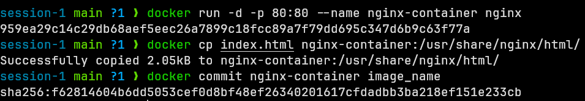
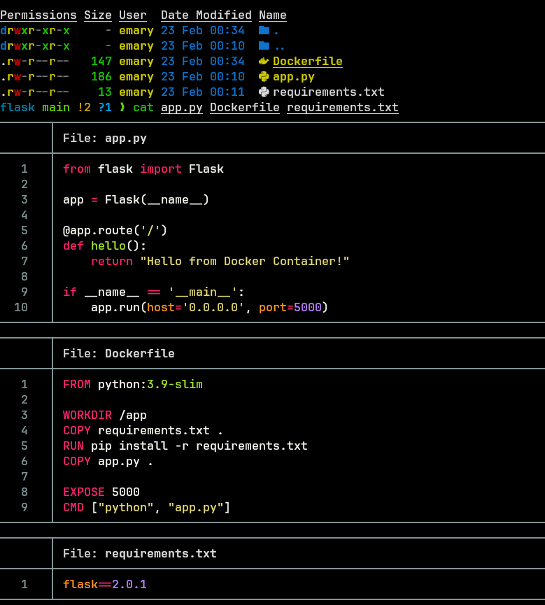

## Question 1

> What is the difference between:
>
> - `CMD` & `ENTRYPOINT`

| Feature               | CMD                           | ENTRYPOINT                         |
| --------------------- | ----------------------------- | ---------------------------------- |
| Primary Purpose       | Provides default arguments    | Configures container as executable |
| Override Behavior     | Easily overridden by CLI args | Requires `--entrypoint` flag       |
| Multiple Instructions | Only last CMD takes effect    | Can combine with CMD args          |
| Use Case              | Default container behavior    | When container acts as binary      |

> - `COPY` & `ADD`

| Feature        | COPY                     | ADD                                   |
| -------------- | ------------------------ | ------------------------------------- |
| Basic Function | Simple file copying      | Advanced file operations              |
| Local Files    | Yes                      | Yes                                   |
| Remote URLs    | No                       | Yes                                   |
| TAR Extraction | No                       | Yes (automatic)                       |
| Transparency   | More transparent         | More complex                          |
| Best Practice  | Preferred for most cases | Use only when special features needed |

## Question 2

> - Run the container `hello-world`
> - Check the container status
> - Start the stopped container
> - Remove the container
> - Remove the image

{ width=90% }

## Question 3

> - Run container centos or ubuntu in an interactive mode
> - Run the following command in the container `echo docker`
> - Open a bash shell in the container and touch a file named `hello-docker`
> - Stop the container and remove it. Write your comment about the file `hello-docker`
> - Remove all stopped containers

{ width=90% }

## Question 4

> - Deploy a MySQL database called `app-database`. Use the mysql latest image, and use the `-e` flag to set `MYSQL_ROOT_PASSWORD` to `P4sSw0rd0!`. The container should run in the background.
>   I had `v8.0` of mysql installed, so I used it instead of `latest`.

{ width=90% }

## Question 5

> - Run the image Nginx
> - Add html static files to the container and make sure they are accessible
> - Commit the container with image name `IMAGE_NAME`

{ width=90% }

{ width=90% }

## Question 6

> - Create a python simple app
> - Create a dockerfile to containerize the python app
> - Build the image and test it
> - (Bonus) create a dockerfile for the same app in smaller size using multi staging
> - Push the created imageinto your docker hub repo

{ width=90% }

{ width=90% }

{ width=90% }

{ width=90% }
