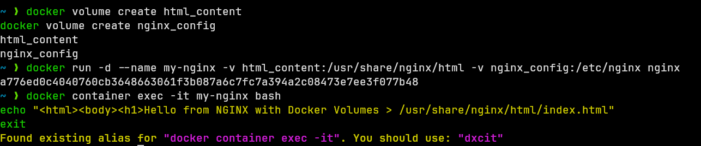
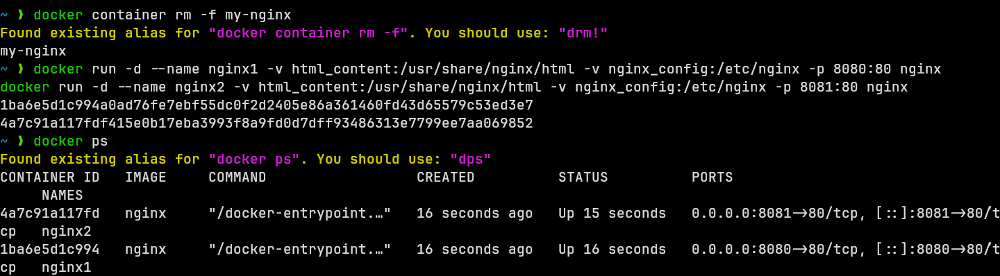
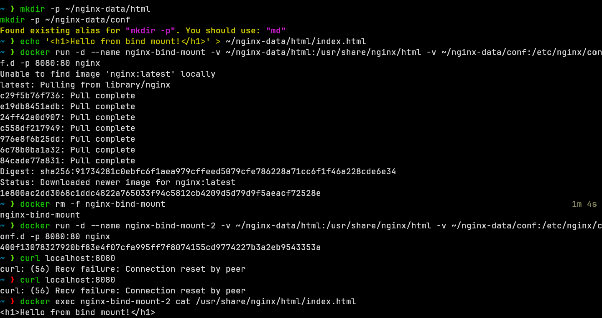
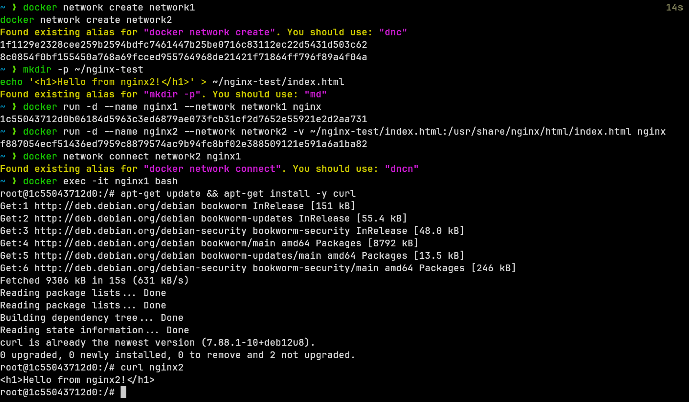
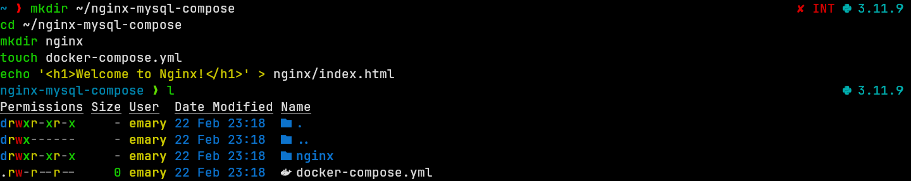
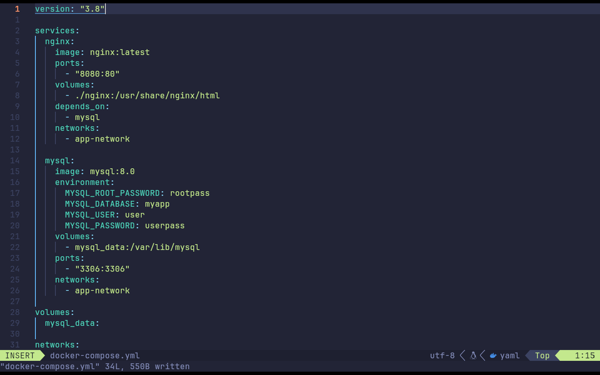
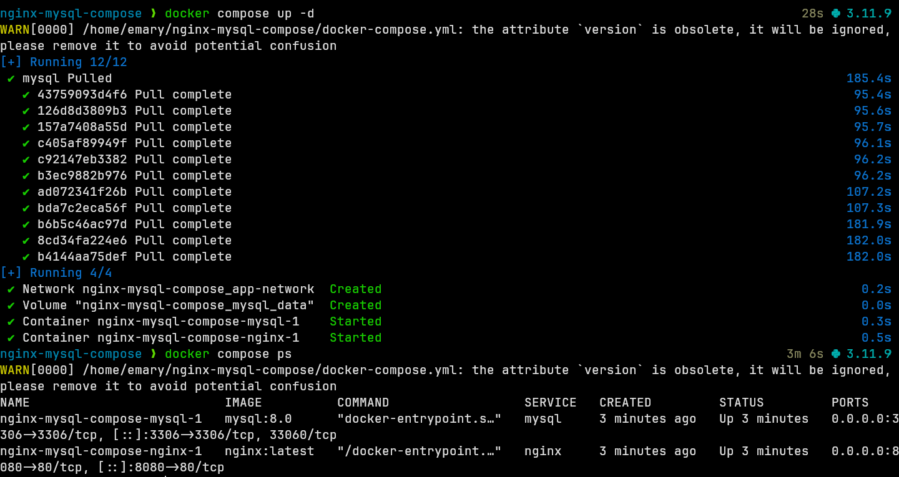

# Assignment Questions

## Question 1

> - Run a container `nginx` with name `my-nginx` and attach 2 volumes to the container using volume mount
> - `Volume1` for containing static html file
> - `Volume2` for containing nginx configuration
> - Edit the html content

{width=70%}

> - Remove the container
> - Run a new 2 containers with the following:
>   - Attach the two volumes that were attached to the previous container using volume mount
>   - Map port 80 to port 8080 on you host machine

{width=70%}

> - Access the html files from your browser

{width=50%}

{width=50%}

## Question 2

> - Run a container Nginx with name `nginx-bind-mount` and attach 2 volumes using bind mount under any paths
> - Remove the container
> - Run a new container with the following:
>   - Attach the two volumes that were attached to the previous container
>   - Check the old data in the new containers

{width=90%}

## Question 3

> - Create 2 nginx containers with 2 different network of type bridge, enter to one of them and use curl command to view the content of the other container.

{width=90%}

## Question 4

> - Create docker compose with:
>   - Two services nginx and mysql
>   - Add needed ports and environments for both services
>   - nginx service is depending on mysql service

{width=90%}

YAML file content:

```yaml
version: "3.8"

services:
  nginx:
    image: nginx:latest
    ports:
      - "8080:80"
    volumes:
      - ./nginx:/usr/share/nginx/html
    depends_on:
      - mysql
    networks:
      - app-network

  mysql:
    image: mysql:8.0
    environment:
      MYSQL_ROOT_PASSWORD: rootpass
      MYSQL_DATABASE: myapp
      MYSQL_USER: user
      MYSQL_PASSWORD: userpass
    volumes:
      - mysql_data:/var/lib/mysql
    ports:
      - "3306:3306"
    networks:
      - app-network

volumes:
  mysql_data:

networks:
  app-network:
    driver: bridge
```

{width=90%}

{width=90%}
