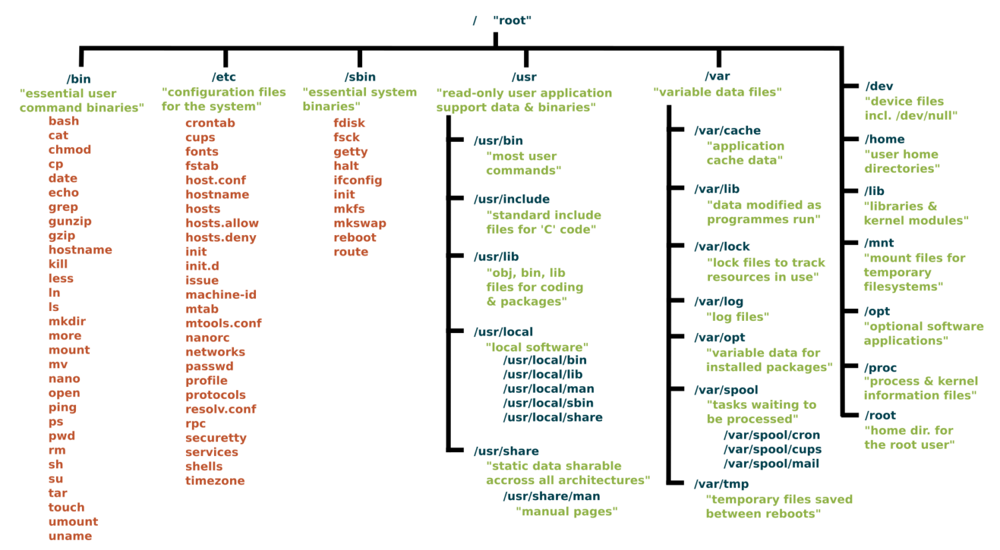

<!-- # Update Vs Upgrade -->

# Commands

See the help or man page of any command. For example: `uname --help`

-   `uname` Command and its options
-   `cal`
-   `date` & `date +`
-   `who`, `whoami`, `w`
-   `pwd`
-   `cd`
-   `ls`
-   `dir`
-   `touch`
-   `cat`
-   `head`
-   `tail`

`pts` VS `tty`

# Linux VS Windows Users

| Window        | Linux |
| ------------- | ----- |
| Administrator | root  |
| Regular User  | user  |

# Linux File System

{ width=80% }

What does each dir in linux file system contain?
