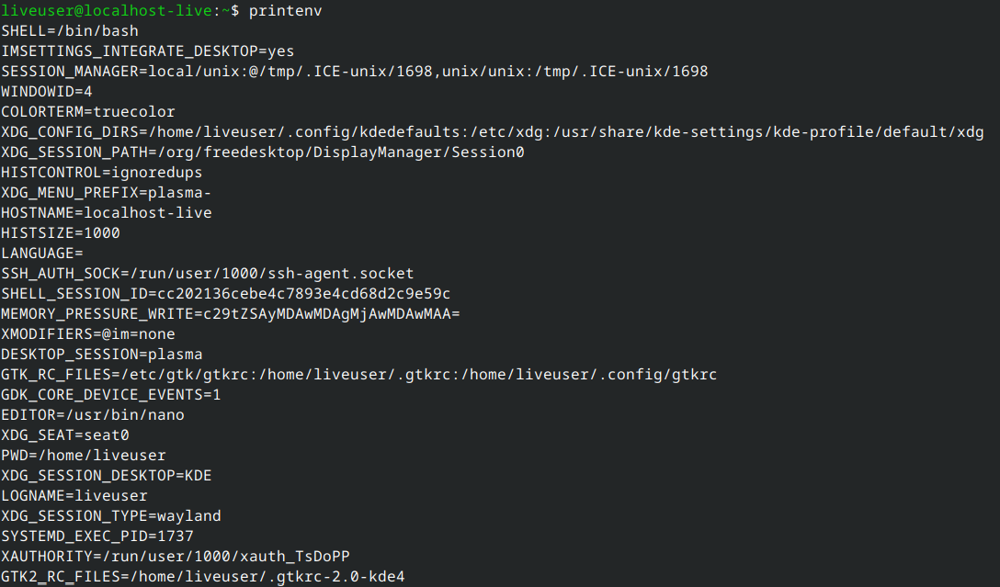

# Questions

Create a user account with the following attributes:

- Username: `islam`
- Fullname/comment: `Islam Askar`
- Password: `islam`

Create a user account with the following attributes:

- Username: `baduser`
- Full name/comment: `Bad User`
- Password: `baduser`

As a superuser, set or change the password of root.

Create a supplementary (secondary) group called `pgroup` with a group ID of `30000`.

Create a supplementary group called `badgroup`.

Add the `islam` user to the `pgroup` group as a supplementary group.

Modify the password of `islam`'s account to `password`.

Modify `islam`'s account so the password expires after 30 days.

Modify `islam`'s account so the account expires after 30 days.

Modify `islam`'s account so the password warning appears 10 days before expiration.

Lock `baduser` account to prevent login.

Delete `baduser` account.

Delete the supplementary group called `badgroup`.

Log out and log in as another user.

List the available shells in your system.

List the environment variables in your current shell.

List all environment variables for the bash shell.

List commands that can display the value of a specific variable.

Display your current shell name.

