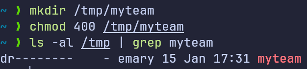
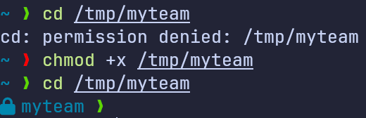
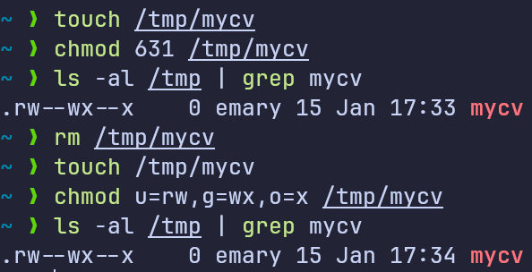
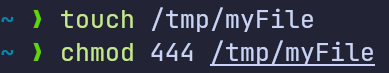
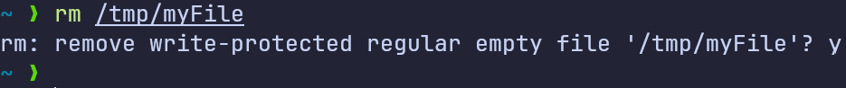
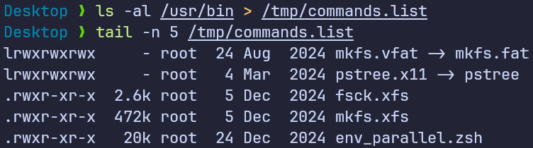
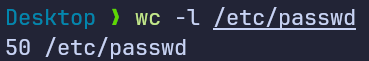
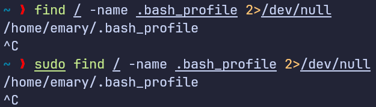
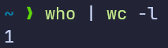
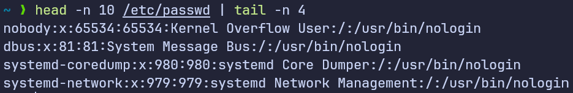

# Assignment Questions

## Question 1

Create a folder called `/tmp/myteam` and set permissions:

- Read only for owner
- No permissions for group and others

{width=60%}

## Question 2

Try to access the folder using `cd` command

{width=60%}

## Question 3

Change permissions of `/tmp/mycv` file:

- Owner: read and write
- Group: write and execute
- Others: execute only
- Do this using chmod in 2 different ways

Using `chmod` with octal values, and using `chmod` with symbolic values:

{width=60%}

## Question 4

Create a file with permission 444 in `/tmp` directory:

{width=60%}

- Try to edit it

  {width=60%}

- Try to remove it

  {width=60%}

- Document what happens:
  - When trying to edit it in Vim \simpleicon{vim} and save the edits with `:wq` we get a warning that the file is readonly and we cannot save the changes.
  - When trying to remove the file using `rm` command we get a warning that the file is readonly and ask if we want to remove it.

## Question 5

Explain the difference between `x` permission for:

- Files
  - For files `x` permission allows the user to execute the file as a program. For example if a file is a shell script, the user needs execute permission to run the script.
- Directories
  - For directories `x` permission allows the user to access the directory (`cd` on it) and list its contents. Without `x` permission the user cannot access the directory or list its contents.

## Question 6

List minimum permissions needed for:

- Copying a file (source file and target directory)
  - Source file: `r--` (read permission)
  - Target directory: `-wx` (write and execute permissions)
- Deleting a file
  - File: `-w-` (write permission)
- Changing to a directory
  - Directory: `--x` (execute permission only)
- Listing directory contents (`ls` command)
  - Directory: `r-x` (read and execute permissions)
- Viewing file contents (`more`/`cat` commands)
  - File: `r--` (read permission)
- Modifying file contents
  - File: `rw-` (read and write permissions)

## Question 7

List user commands from `/usr/bin` and redirect output to `/tmp/commands.list`

{width=60%}

<!-- ## Question 8

Count number of users on your machine

{width=60%} -->

## Question 9

Search for username `games` on your machine

{width=60%}

<!-- ## Question 10

Get login names of users

## Question 11

Get full names (comments) of users

## Question 12

Find users whose login names start with `g`

## Question 13

Get login names and full names for users starting with `g`

## Question 14

Save sorted output of previous command to a file -->

## Question 15

Write two commands:

- Search for all files named `.bash_profile` on the system

{width=60%}

<!-- - Sort `ls` output on `/` recursively:
  - Save output and errors in separate files
  - Run in background -->

## Question 16

Display number of currently logged-in users

{width=60%}

## Question 17

Display lines 7-10 of `/etc/passwd` file

{width=60%}

## Question 18

Search for `.bash_profile` files using two different methods

Similar to [Question 15](#question-15).
