# Assignment Questions

## Question 1, 2

Issue the command `sleep 100` then stop the command

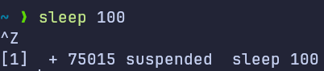{width=40%}

## Question 3

Resume `sleep` command in the background

{width=60%}

## Question 4

Issue the `jobs` command and view its output

{width=40%}

## Question 5

Send the `sleep` command to:

- Foreground
- Then back to background

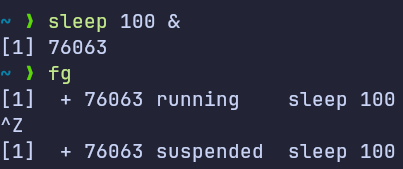{width=60%}

## Question 6

Kill the `sleep` command

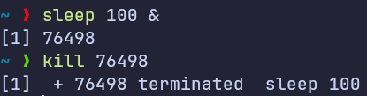{width=60%}

## Question 7

Display your processes only (processes started by your username)

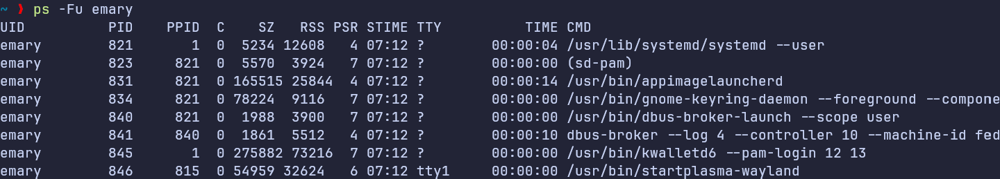{width=90%}

## Question 8

Display all processes except yours

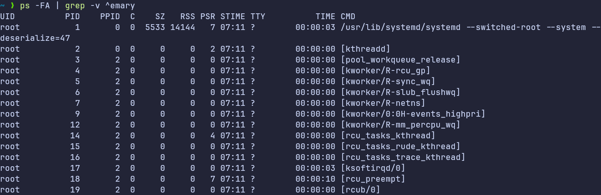{width=90%}

## Question 9

Use the `pgrep` command to list your processes only

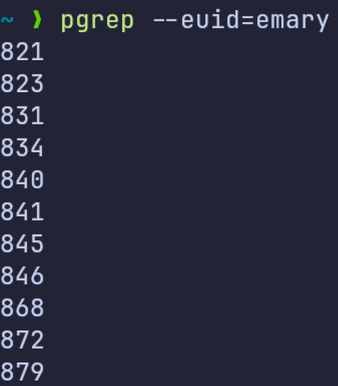{width=40%}

## Question 10

Start Firefox application

> _PS: I started chromium browser instead of Firefox_

{width=30%}

## Question 11

Send kill signal to Firefox

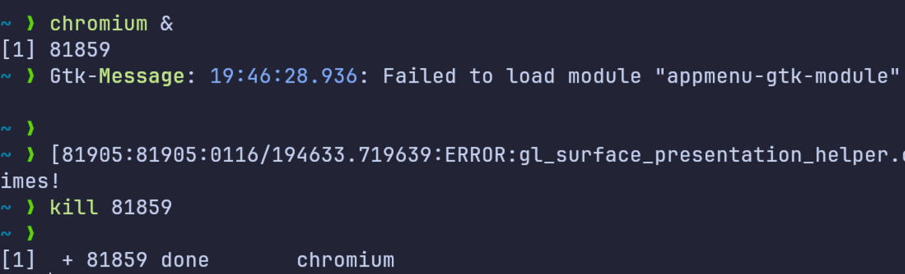{width=60%}

## Question 12

Change nice value of an already running process

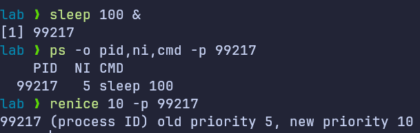{width=60%}

## Question 13

Compress a file using: `gzip`, `bzip2` Then decompress it

**_Compression using `gzip`, `bzip2`:_**

Here I have saved the first 1000 lines of `journalctl` logs in a file named `journal.log` and compressed it using `gzip`, `bzip2` the file size before compression is 141kb and after compression the archive file size is 8.7kb with `gzip` and 7.7kb with `bzip2`:

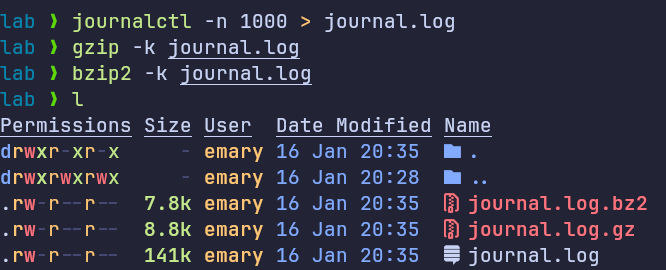{width=60%}

**_Compression using `gzip`, `bzip2`:_**

After decompressing each archive file, the file size is back to 141kb:

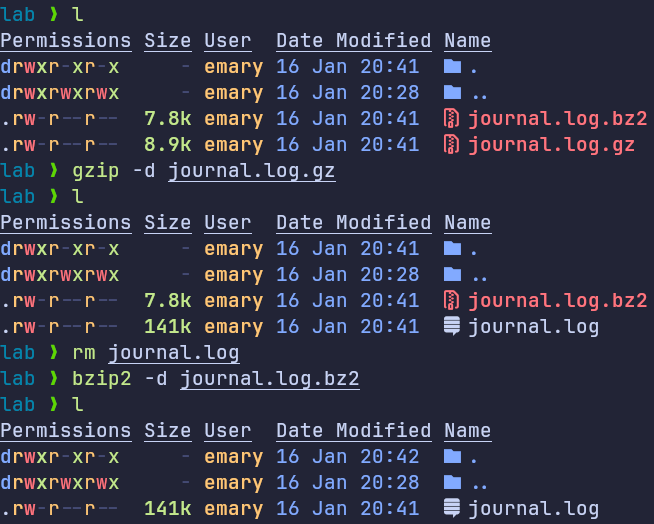{width=60%}

## Question 14

State the differences between `gzip` and `bzip2` commands

- `gzip` is generally faster but has a lower compression ratio.
- `bzip2` has a higher compression ratio but is slower.

## Question 15

Backup/Archive `/etc` directory using `tar` utility

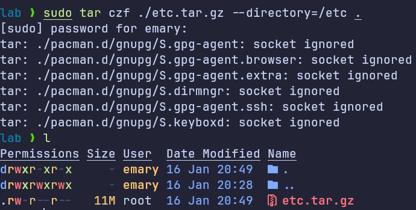{width=60%}

## Question 16

Install packages: `ncompress`, `ksh`

command for Debian-based systems: `sudo apt install ncompress ksh`

> _I'm using a non-Debian based system (a distro based on [Arch Linux](https://archlinux.org/)), so I used `pacman` package manager to install the packages._

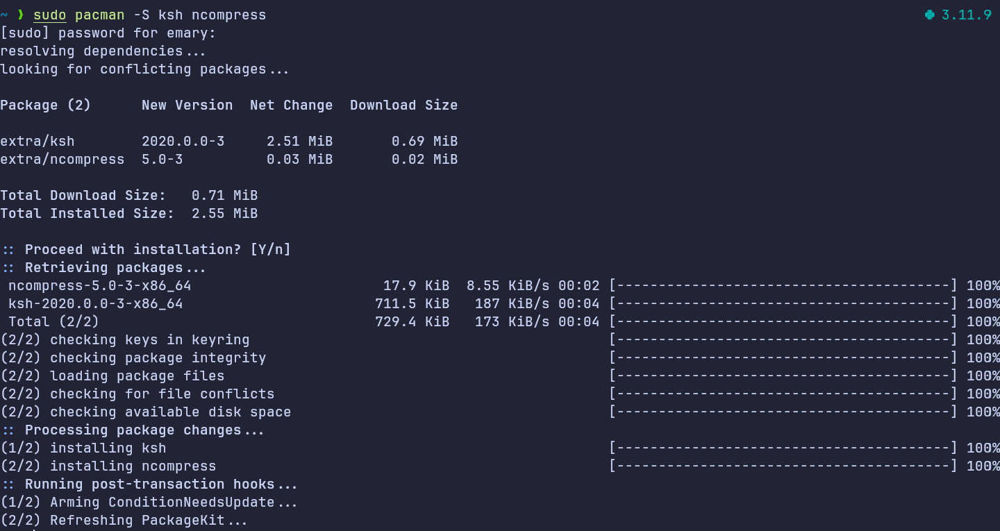{width=80%}

## Question 17

Remove packages: `ncompress`, `ksh`

command for Debian-based systems: `sudo apt remove ncompress ksh`

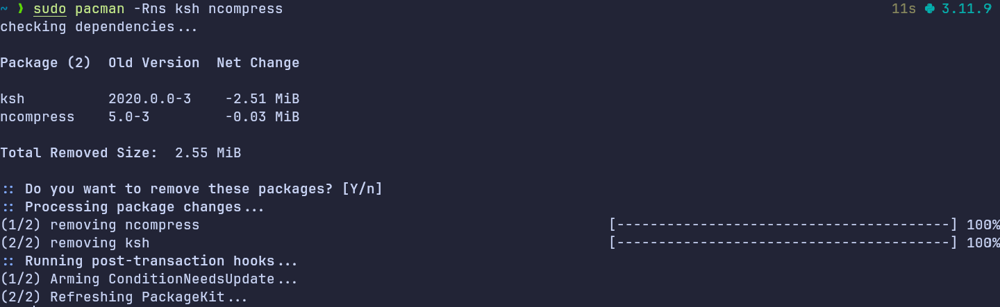{width=80%}

## Question 18

Kill all your processes (Warning: Save work before execution)

{width=40%}
