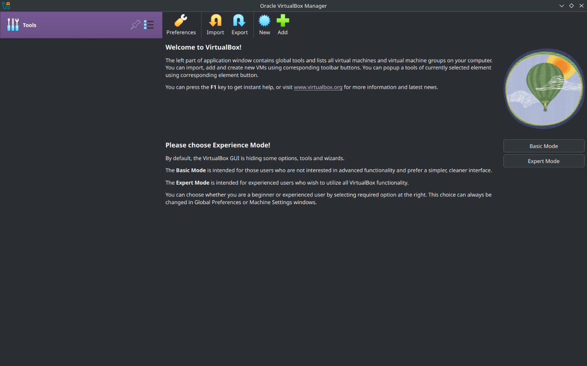
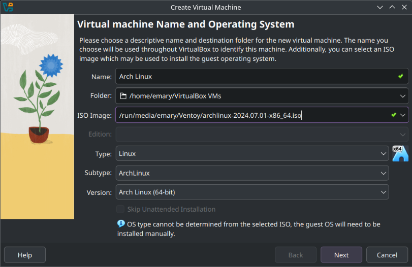
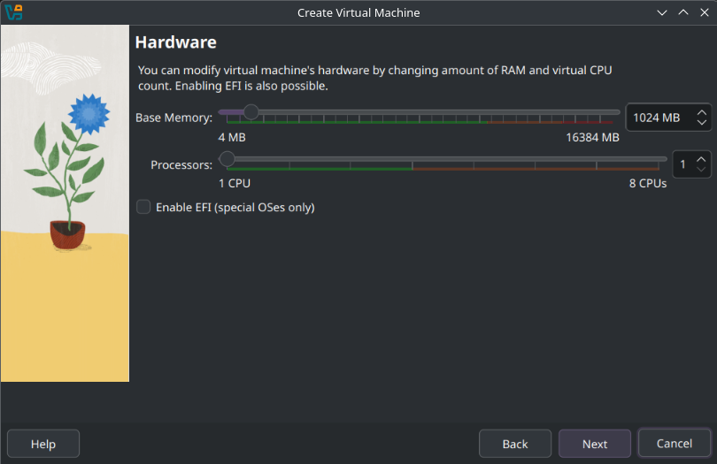
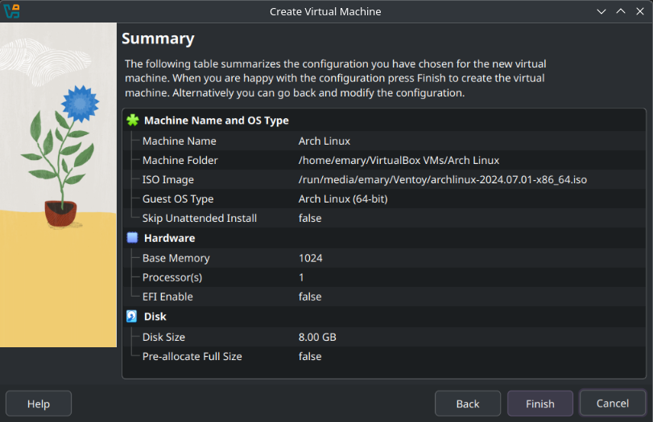

\begin{box3}{Note}{black}
I'm using Linux \simpleicon{linux} so the commands might be a bit different than those on Windows \simpleicon{windows}
\end{box3}

# Session 1 Practices

## Find Your MAC Address

<!--  -->

Command: `ip link show wlan0`

Result:

\scriptsize

```{ .numberLines}
~ > ip link show wlan0
3: wlan0: <BROADCAST,MULTICAST,UP,LOWER_UP> mtu 1500 qdisc noqueue state UP mode DORMANT group default qlen 1000
    link/ether dc:f6:42:94:28:b3 brd ff:ff:ff:ff:ff:ff
```

\normalsize

The MAC address is `dc:f6:42:94:28:b3`

## Find Your Real IP Addresses

Command: `curl ifconfig.me`

Result:

```{ .numberLines}
~ > curl ifconfig.me
102.129.153.12%
```

The real IP address is `102.129.153.12`

## Find Your Private IP Addresses

Command: `ifconfig wlan0`

Result:

```{ .numberLines}
~ > ifconfig wlan0
wlan0: flags=4163<UP,BROADCAST,RUNNING,MULTICAST>  mtu 1500
        inet 192.168.1.13  netmask 255.255.255.0  broadcast 192.168.1.255
        inet6 fe80::d27d:a882:c025:561c  prefixlen 64  scopeid 0x20<link>
        inet6 fd9c:62d1:63a6:800:f41b:6ad3:f518:ab29  prefixlen 64  scopeid 0x0<global>
        ether dc:f6:42:94:28:b3  txqueuelen 1000  (Ethernet)
        RX packets 32489  bytes 26506732 (25.2 MiB)
        RX errors 0  dropped 0  overruns 0  frame 0
        TX packets 18682  bytes 32144289 (30.6 MiB)
        TX errors 0  dropped 7 overruns 0  carrier 0  collisions 0
```

The private IP address is `192.168.1.13`

## Find Current Session And Ports On Your Device

Command: `netstat -ntlp`

Result:

\scriptsize

```{ .numberLines}
~ > netstat -ntlp
(Not all processes could be identified, non-owned process info
 will not be shown, you would have to be root to see it all.)
Active Internet connections (only servers)
Proto Recv-Q Send-Q Local Address           Foreign Address         State       PID/Program name
tcp        0      0 127.0.0.1:5054          0.0.0.0:*               LISTEN      1474/python
tcp        0      0 127.0.0.1:631           0.0.0.0:*               LISTEN      -
tcp6       0      0 :::1716                 :::*                    LISTEN      1323/kdeconnectd
tcp6       0      0 ::1:631                 :::*                    LISTEN      -
```

\normalsize

## Find The IP Of The Domain `yahoo.com`

Command: `host yahoo.com`

Result:

```{ .numberLines}
~ > host yahoo.com
yahoo.com has address 74.6.231.20
yahoo.com has address 98.137.11.164
yahoo.com has address 98.137.11.163
yahoo.com has address 74.6.143.26
yahoo.com has address 74.6.143.25
yahoo.com has address 74.6.231.21
yahoo.com has IPv6 address 2001:4998:24:120d::1:1
yahoo.com has IPv6 address 2001:4998:24:120d::1:0
yahoo.com has IPv6 address 2001:4998:44:3507::8000
yahoo.com has IPv6 address 2001:4998:124:1507::f000
yahoo.com has IPv6 address 2001:4998:44:3507::8001
yahoo.com has IPv6 address 2001:4998:124:1507::f001
yahoo.com mail is handled by 1 mta6.am0.yahoodns.net.
yahoo.com mail is handled by 1 mta7.am0.yahoodns.net.
yahoo.com mail is handled by 1 mta5.am0.yahoodns.net.
```

# Session 2 Practices

_Question_: How to use your local firewall to block a port and stop DOS attack from a zombie device?

_Answer_:

To block a port and stop a DoS attack from a zombie device using your local firewall, we can do the following:

1.  **Limit Connections by Source IP:**

    - Set a limit on how many connections a single IP address can make to your server at the same time, to stops one zombie device from overwhelming your server.
    - In your firewall settings, find `source-based session limits` and set a reasonable number.

2.  **Limit Connections by Destination IP:**

    - Set a limit on how many connections can go to your server's IP address, regardless of where they come from to protect your server from being overwhelmed, even with many attacking IPs.
    - In your firewall settings, find `destination-based session limits` and set a reasonable number.

3.  **Identify and Block Attacking IPs:**

    - Check your firewall logs to find IPs sending a lot of traffic, to block the source of the attack directly.
    - Add those IPs to your firewall's block list.

4.  **Block IP Ranges:**

    - If the attacker uses a VPN, you can try blocking entire IP ranges associated with that service, this can be effective, but be careful not to block legitimate users.
    - Identify the IP range and add it to your firewall's block list.

# Session 3 Practices

_Question_: Use the VmwareWorkstation tool to host the two differentOS on your machine.

{width=97%}

{width=65%}

{width=65%}

{width=65%}

{width=65%}
