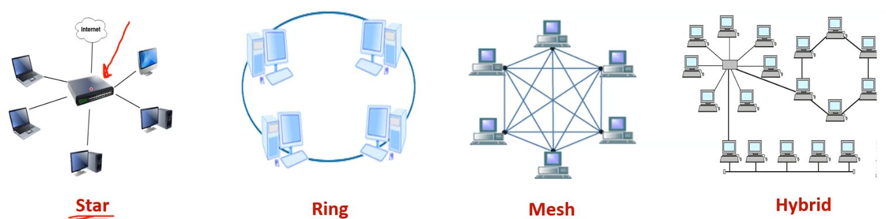

Our day will be divided into three main sections:

1. Network
2. Security
3. Cloud & Virtualization

# Computer Network

A computer network is a collection of computers and other hardware devices connected together via cabels or wireless connections.

The purpose of a computer network is to share:

- Files
- Devices
- Software with multi-user licenses
- Voice and Video calls
- Internet Access

## Network Components

<!-- prettier-ignore-start -->
- Hardware
  - Devices: Computers - Printers - Phone - Routers - Switches
  - Medium: Wired - Wireless - Satellites

<!-- prettier-ignore-end -->

- Software
  - Messages: Information that travels over the medium such as Mails/WhatsApp....etc
  - Protocols: Governs how messages flow across network such as http/https/FTP/RDP

```{.mermaid caption="Network Components"}
graph TD
    Network[Network Infrastructure] --> Hardware
    Network --> Software

    Hardware --> Devices
    Hardware --> Medium

    Devices --> D1[Computers]
    Devices --> D2[Printers]
    Devices --> D3[Phones]
    Devices --> D4[Routers]
    Devices --> D5[Switches]

    Medium --> M1[Wired]
    Medium --> M2[Wireless]
    Medium --> M3[Satellites]

    Software --> Messages
    Software --> Protocols

    Messages --> MSG[Mails/WhatsApp etc.]

    Protocols --> P1[HTTP]
    Protocols --> P2[HTTPS]
    Protocols --> P3[FTP]
    Protocols --> P4[RDP]
```

HTTP is not secure, HTTPS is secure. FTP is used for file transfer. RDP is used for remote desktop, it allows you to connect to a computer from another computer.

## Network Technologies

- Network Interface Card/Network adapter/LAN adapter is a hardware that enable the device to directly access the network:
  - Internal NIC (plugs into the motherboard directly)
  - External NIC(Wireless and USB based )
- Mac address is a Physical (burned on the NIC card) and Unique address over the world.
- IP address is logical address, used to identify each device on an IP network layer.
- Protocols are communication rules that all entity must agree on http/https/FTP/RDP

## Network Devices

- Hub
  - Allow different nodes to communicate with each other at the same network (Slow the network).
- Repeater
  - Regenerate the signal over the same network before the signal becomes too weak or corrupted.
- Access point (AP)
  - allows other Wi-Fi devices to connect to a wired network. An AP is a physical location where Wi-Fi access is available.
- Switch
  - Allow different nodes to communicate with each other at the same network and time without slowing each other.
  - It's considered as a better version of the hub, it understands the MAC address of each device connected to it, so it can send the data directly to the device without broadcasting it to all devices and without collision.
- Router
  - Allow different networks to communicate with each other.

## Network Topologies

How devices are connected (shape) and how message flow from one device to another device, Each topology has its own advantages and disadvantages.

{height=150px}
