# Good Website Designs

## Example 1: Apple

- Clean and minimalist design
- High-quality images
- Easy navigation

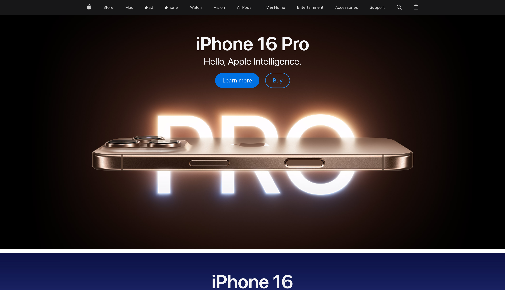{width=80%}

## Example 2: Airbnb

- User-friendly interface
- High-quality visuals
- Clear call-to-action buttons

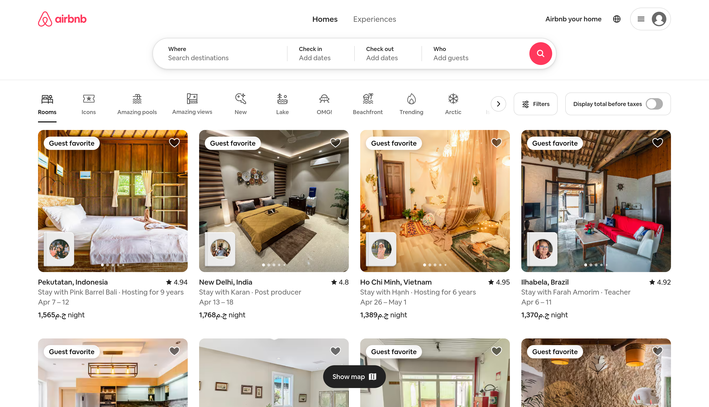{width=80%}

## Example 3: Dropbox

- Simple and intuitive design
- Clear messaging
- Effective use of whitespace

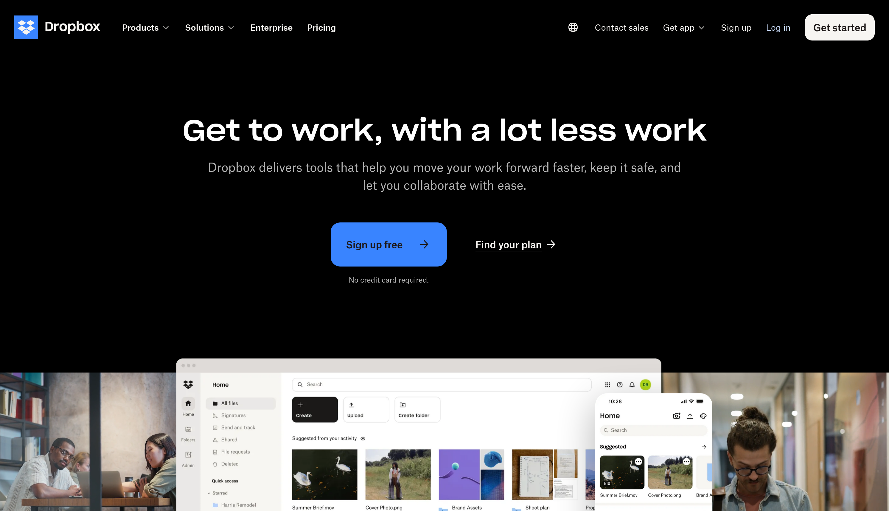{width=80%}

## Example 4: Slack

- Consistent branding
- Easy-to-read typography
- Clear navigation

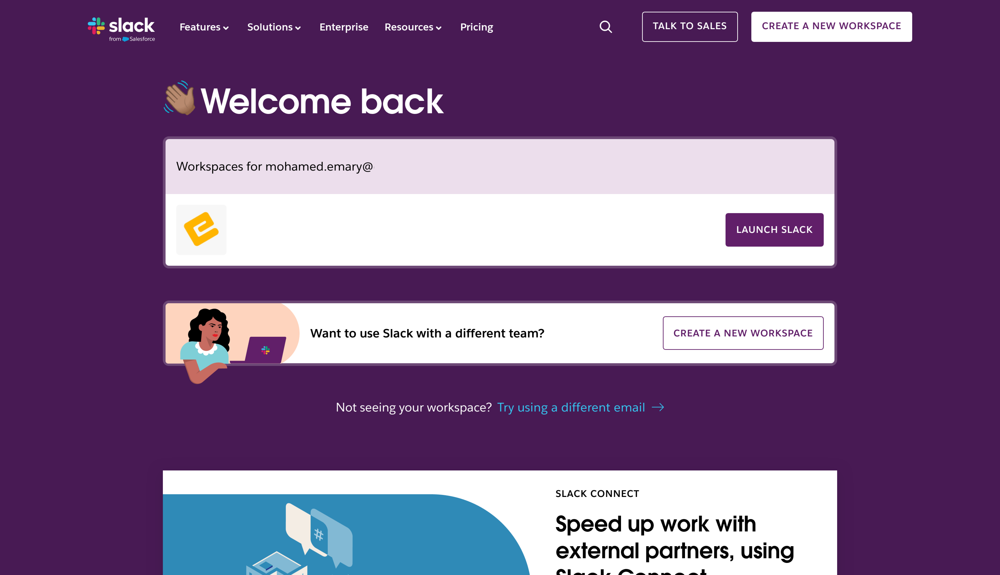{width=80%}

## Example 5: Medium

- Clean and readable layout
- Focus on content
- Easy navigation

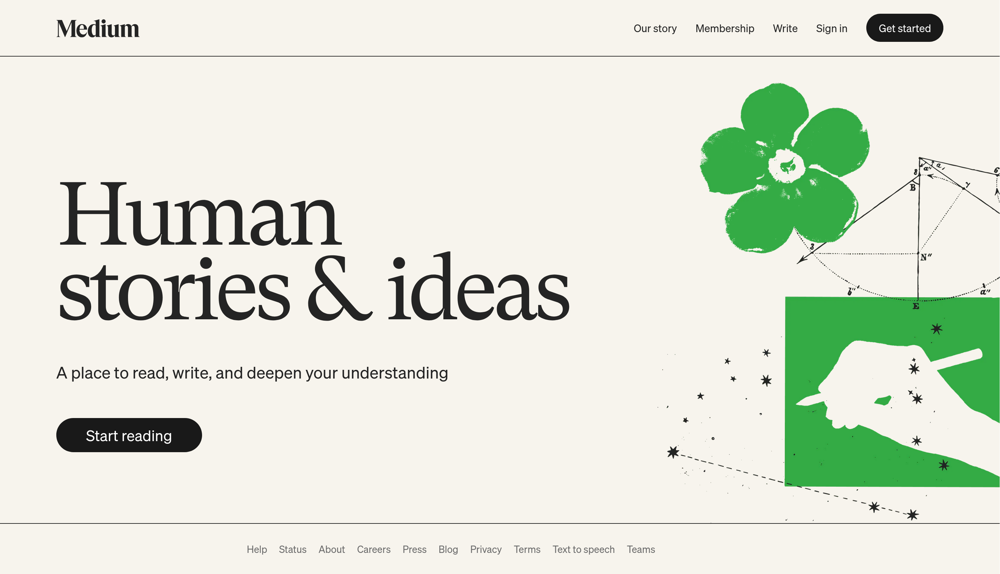{width=80%}

## Example 6: Spotify

- Visually appealing design
- Easy-to-use interface
- Consistent branding

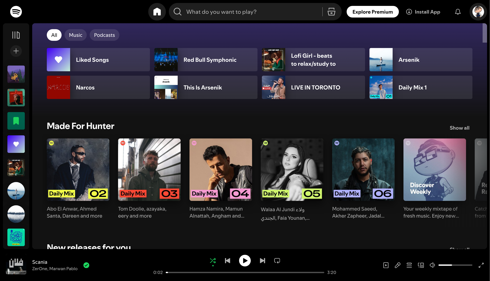{width=80%}

## Example 7: Trello

- Simple and intuitive design
- Clear visual hierarchy
- Easy navigation

{width=80%}

## Example 8: Asana

- Clean and modern design
- Easy-to-use interface
- Effective use of color

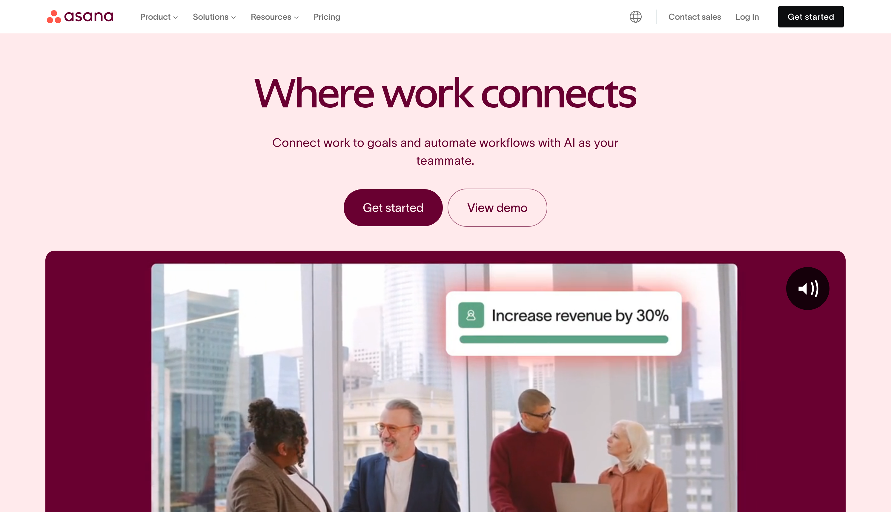{width=80%}

## Example 9: Stripe

- Professional and clean design
- Clear messaging
- Easy navigation

{width=80%}

## Example 10: Google

- Simple and minimalist design
- Fast loading times
- Easy-to-use interface

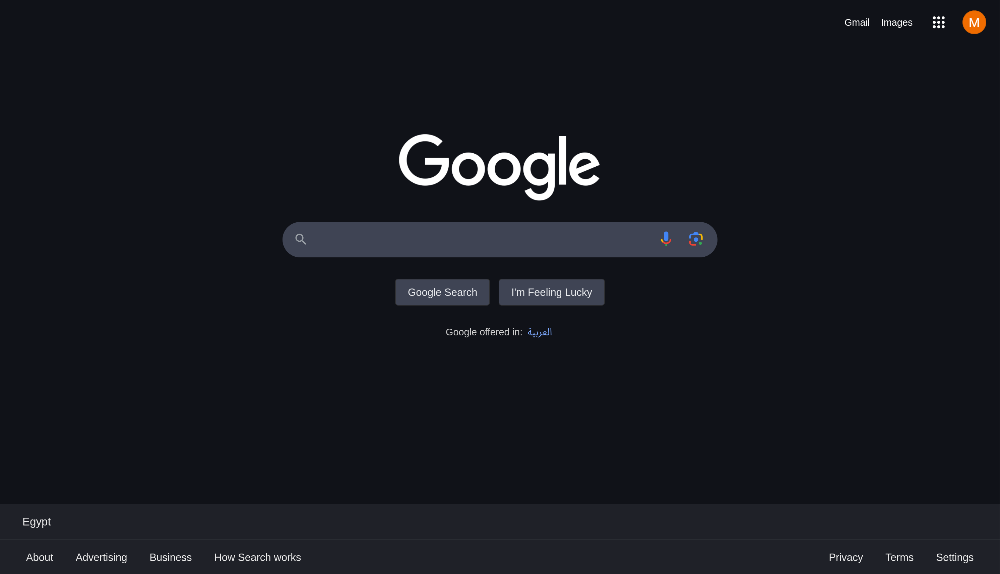{width=80%}

# Bad Website Designs

## Example 1: Arngren

- Cluttered layout
- Poor use of color
- Difficult navigation

{width=80%}

## Example 2: LingsCars

- Overwhelming visuals
- Poor typography
- Confusing navigation

{width=80%}

## Example 3: Yale School of Art

- Unconventional layout
- Difficult to navigate
- Poor readability

{width=80%}

## Example 4: Pacific Northwest X-Ray Inc.

- Outdated design
- Poor use of color
- Difficult navigation

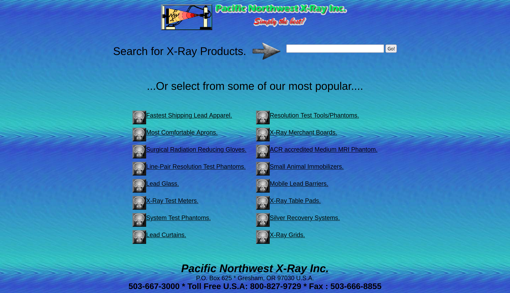{width=80%}

## Example 5: Suzanne Collins Books

- Cluttered layout
- Poor typography
- Difficult navigation

{width=80%}

## Example 6: Penny Juice

- Poor use of color
- Cluttered layout
- Difficult navigation

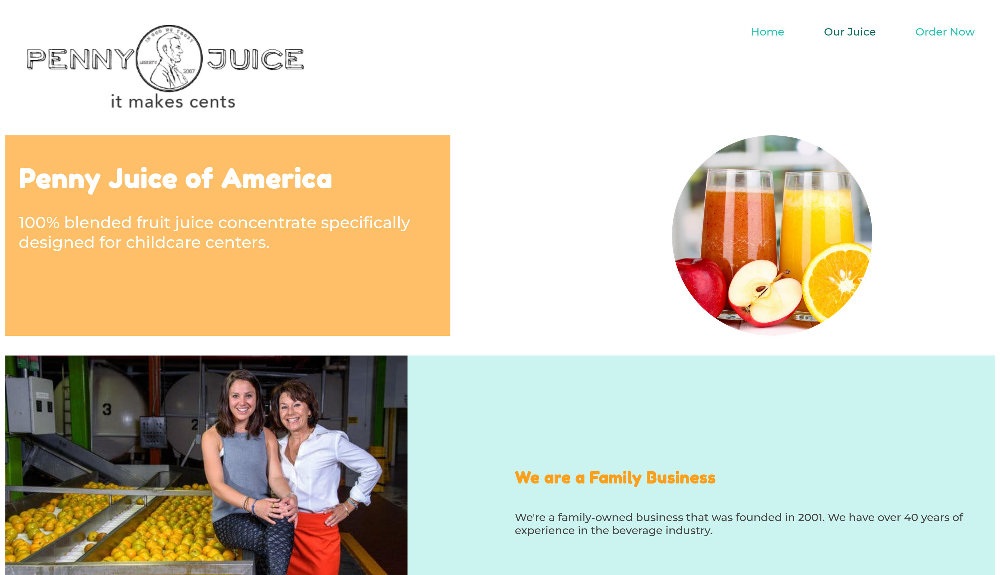{width=80%}

## Example 7: Jamilin

- Outdated design
- Poor use of color
- Difficult navigation

{width=80%}

## Example 8: The World’s Worst Website Ever

- Intentionally bad design
- Cluttered layout
- Poor readability

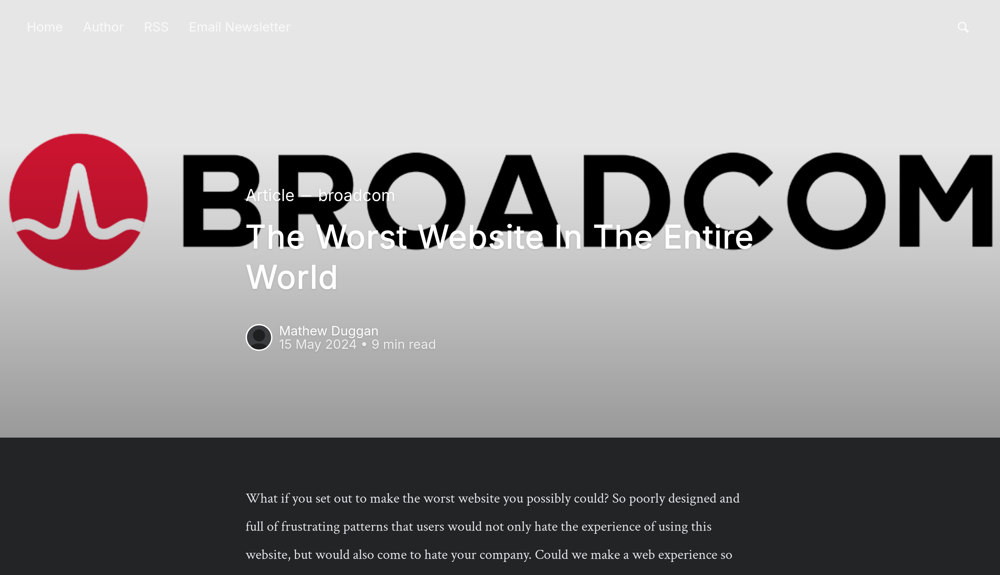{width=80%}

## Example 9: Exmouth View Hotel

- Outdated design
- Poor use of color
- Difficult navigation

{width=80%}

## Example 10: Gates N Fences

- Cluttered layout
- Poor use of color
- Difficult navigation

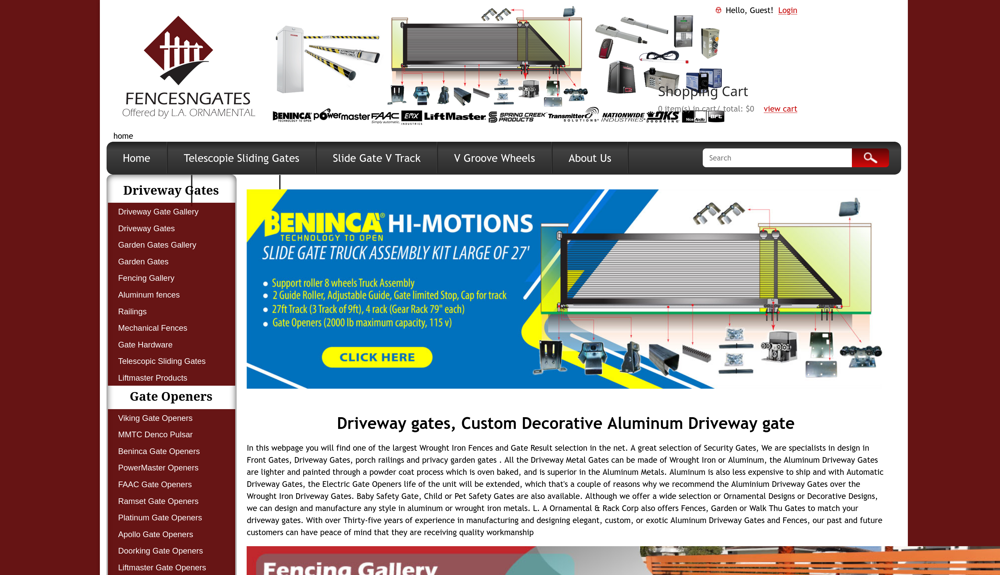{width=80%}

# Good Product Design

---

| Product         | Reason for Good Design                         |
| --------------- | ---------------------------------------------- |
| iPhone          | Intuitive interface, sleek design              |
| Tesla Model S   | Innovative technology, user-friendly interface |
| Nest Thermostat | Simple design, easy to use                     |
| Kindle          | Easy to read screen, long battery life         |
| Dyson Vacuum    | Powerful suction, ergonomic design             |
| MacBook Pro     | High performance, sleek design                 |
| GoPro           | Durable, easy to use                           |
| Sonos Speakers  | High-quality sound, easy setup                 |
| Fitbit          | User-friendly interface, sleek design          |
| Nintendo Switch | Versatile, user-friendly interface             |

# Bad Product Design

---

| Product               | Reason for Bad Design                       |
| --------------------- | ------------------------------------------- |
| Juicero               | Over-engineered, expensive                  |
| Google Glass          | Unattractive design, privacy concerns       |
| Microsoft Zune        | Poor marketing, lack of unique features     |
| Samsung Galaxy Note 7 | Battery issues, safety concerns             |
| Segway                | Bulky, difficult to use                     |
| Blackberry Storm      | Poor touch interface, slow performance      |
| Nokia N-Gage          | Awkward design, poor usability              |
| HP TouchPad           | Poor performance, lack of app support       |
| Windows Vista         | Performance issues, user interface problems |
